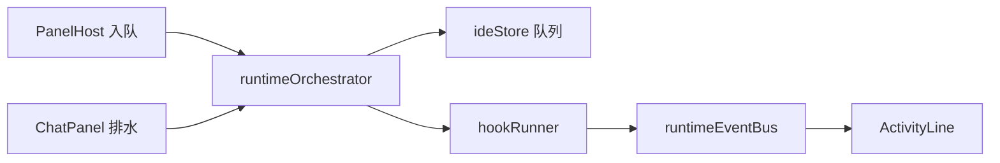

# ADR: v1.5 AIDE Runtime — Spec 工程运行内核

> **状态**：Accepted（v1.4.4 评审）  
> **日期**：2026-06-05  
> **RFC**：[AIDE_RUNTIME.md](./AIDE_RUNTIME.md) v0.2  
> **战略**：[V1.5_STRATEGY_PIVOT.md](./V1.5_STRATEGY_PIVOT.md)

---

## 背景

v1.1.1 已交付 **Plan → Spec → 队列 → 报告** 闭环，但实现分散：

| 现状 | 位置 |
|------|------|
| Spec 入队 | `PanelHost.tsx` · `ChatPanel.tsx` |
| Plan 入队 | `planExecutionService` · `ChatPanel` effects |
| 队列持久化 | `specQueuePersistenceService` · `planQueuePersistenceService` |
| Plan↔Spec 链接 | `planSpecLinkService` → `.aide/meta/plan-spec-links.json` |
| 报告 | `queueExecutionReportService` → `.aide/reports/` |

缺少：**统一编排**、**可配置 Hook**、**验收自动化**、**运行态可观测**（Activity Line）。v1.5 要冲击 Kiro 级 Spec 工程 **轻量子集**，不能继续在 Chat 内堆 if/else。

---

## 决策

### D1 — 引入 `runtimeOrchestrator` 作为唯一入队门面

**决定**：所有 Plan/Spec/Adhoc 执行请求经 `runtimeOrchestrator.enqueue(intent)`，内部再写入 `ideStore` 既有队列字段。

**不决定**：v1.5 F4 之前不删除 `PanelHost`/`ChatPanel` 直接入队路径；先 **双写 + 特性开关**，验证后迁移。

```typescript
// 拟：src/services/runtime/runtimeOrchestrator.ts
export type RuntimeIntentKind = 'plan' | 'spec' | 'adhoc'

export interface RuntimeIntent {
  kind: RuntimeIntentKind
  targetPath: string
  prompt: string
  backfill?: { taskPath: string; taskText: string; specAcceptancePath?: string }
  source?: 'chat' | 'palette' | 'plan-map' | 'hook'
}
```

### D2 — Spec 工件三件套 + `hooks.yaml`

**决定**：每个 `.aide/specs/<feature>/` 目录标准文件：

| 文件 | 必需 | 说明 |
|------|:----:|------|
| `tasks.md` | ✅ | 已有 |
| `acceptance.md` | 推荐 | 已有；v1.5 增加机器可解析块 |
| `hooks.yaml` | 可选 | v1.5 新增 |

**hooks.yaml `version: 1`**，v1.5 仅支持四类 `on`：

| `on` | 时机 |
|------|------|
| `queue.before` | Spec/Plan 队列项**开始执行前** |
| `queue.after` | 单项执行**成功后** |
| `apply.after` | Agent Diff **应用成功后** |
| `verify.fail` | `acceptanceRunner` **失败后** |

三类 `run`：`shell` · `agent` · `enqueue`（禁止 v1.5 做任意脚本市场）。

### D3 — 浏览器 / 桌面 Hook 执行策略

| `run: shell` | 浏览器 | 桌面 Electron |
|--------------|--------|---------------|
| 行为 | **skip** + Activity Line 警告 | `localProjectService` / PTY 执行 |
| 用户提示 | toast「需桌面壳运行此 Hook」 | 正常 |

**决定**：不在浏览器内伪造 shell Hook；诚实降级，避免 WebContainer 误导。

### D4 — `acceptance.md` 机器块格式

**决定**：在 Markdown 中嵌入 fenced 块，供 `acceptanceRunner` 解析：

```markdown
## 验收清单

- [ ] UI 显示登录按钮
- [ ] `npm run test:local` 通过

```aide-acceptance
commands:
  - npm run test:local
```
```

- checkbox 行：人工 + 未来视觉断言（v1.5 仅 checkbox 未勾 → verify.fail）
- `aide-acceptance` 块：桌面/WebContainer 能跑则跑，不能跑则 skip 并记入报告

### D5 — `runtime-state.json` 持久化

**路径**：`.aide/meta/runtime-state.json`

```json
{
  "version": 1,
  "activeSpecPath": ".aide/specs/auth-login/tasks.md",
  "queueSnapshot": {
    "specPending": 2,
    "planPending": 0
  },
  "lastHookResults": [
    { "hookId": "pre-run-tests", "at": "2026-06-05T10:00:00Z", "status": "ok" }
  ],
  "updatedAt": "2026-06-05T10:00:05Z"
}
```

**决定**：与 IndexedDB 队列持久化 **并存**；`runtime-state` 供设置页/Activity Line 只读展示，v1.5 F6 写入。

### D6 — Activity Line 事件总线

**决定**：轻量 pub/sub `runtimeEventBus`（内存），事件类型 v1.5 冻结：

`queue.progress` · `agent.fileWrite` · `hook.start` · `hook.end` · `verify.fail`

UI：`ActivityLine.tsx` 订阅，默认 **折叠**；`VITE_AIDE_RUNTIME_UI` 特性开关（v1.5 F5，1.4.8 仅 RFC）。

### D7 — 与 Tab++ 上下文总线

**决定**：`runtimeContextSnapshot()` 只读 API，供 Tab++ F2 读取：

- `activeSpecPath`
- 当前 `tasks.md` 第一条未完成 `- [ ]` 行
- 最近 5 条 Activity 事件摘要

**禁止**：Tab 补全请求写入队列或触发 Hook。

### D8 — 特性开关分层

| 开关 | 阶段 | 默认 |
|------|------|------|
| `VITE_AIDE_RUNTIME` | v1.5 F4 | 关 |
| `VITE_AIDE_RUNTIME_UI` | v1.5 F5 | 关 |
| hooks 执行 | v1.5 F4 | 随 `VITE_AIDE_RUNTIME` |

1.4.x **禁止**开启生产执行（1.4.5 仅 schema，1.4.8 仅 orchestrator stub）。

---

## 迁移计划（v1.5 F4）



1. **F3**：`hooksSchema.ts` 校验 YAML  
2. **F4**：orchestrator 双写；`hookRunner` 实现四类 `on`  
3. **F5**：Activity Line UI  
4. **F6**：`acceptanceRunner` + `runtime-state.json`  
5. **F7**：移除旧直写路径（或保留 legacy 一个版本）

---

## 非目标（v1.5）

- Kiro Agent Hooks 市场 / CloudTrail 审计
- 任意用户上传 Hook 包
- VSIX 触发器
- 全量 LSP 驱动验收
- 宣传 / 上架

---

## 后果

| 领域 | 变更 |
|------|------|
| 新目录 | `src/services/runtime/` |
| 设置 | `SettingsV15FeaturesCard` · Spec 目录 Hook 状态 |
| E2E | `e2e/aide-runtime.spec.ts`（v1.5 F7） |
| 文档 | `AIDE_RUNTIME.md` · `V1.5_ENV.md` |
| 竞品 | Spec 工程维度 v1.5 目标 +0.4～+0.6 |

---

## 开放问题（1.4.9 前闭合）

1. `queue.after` 是否在「整队排空」时再触发一次汇总 Hook？→ **v1.5 仅 per-item**  
2. `run: agent` Hook 是否消耗用户配额？→ **是，计入 Agent 用量**  
3. WebContainer 跑 `npm test` 超时策略？→ **30s 硬超时，记入 verify.fail**
