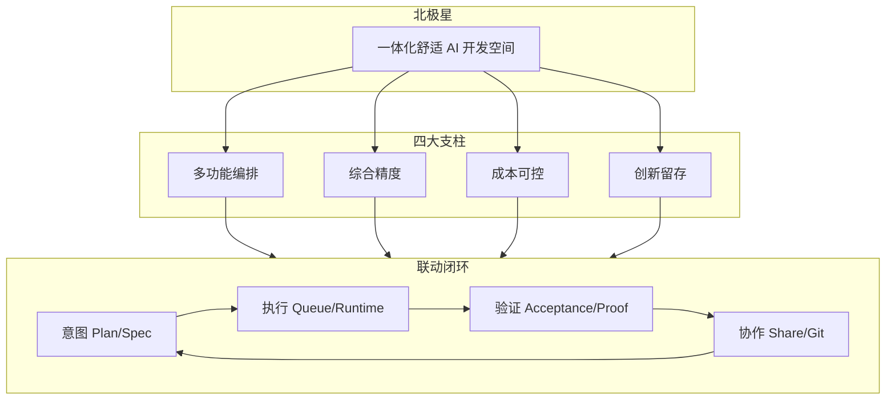

# AIDE 总规划 — 多功能一体化智能开发空间

> **更新**：2026-06-05 · 内测 IP 已同步 Phase 1–8（代码）
> **宗旨**：打造 **多功能、高精度（综合精度，非与 Cursor 比单一 Tab/补全精度）、低成本、高收益、有创新性** 的 **一体化舒适 AI 空间**。  
> **不做**：烧钱买量、硬刚 Cursor/Trae 单点、公益 IDE 叙事、宣传先于产品。  
> **要做**：Plan · Spec · Intent · AI · Git · 运行 · 分享 **联动成闭环**，开发者「打开就舒服、用得省、链路顺」。

---

## 一、北极星（由大到小）

| 维度 | 含义 | 与 Cursor 等差异 |
|------|------|------------------|
| **多功能** | 编辑 · 终端 · Git · AI Chat/Agent · Plan · Spec · Intent Shell · 分享 · 协作 · 插件 | 不是「只有编辑器 + AI」 |
| **综合精度** | Spec 验收、Plan 映射、队列可恢复、证明包留档 | 精度体现在 **工程闭环**，不是单点 FIM |
| **低成本** | 平台 DeepSeek/Qwen 加权配额 · BYOK 可选 · 控 API  burn | 不补贴无限 Token |
| **高收益（用户）** | 少切换工具、少丢上下文、可分享进度 | ROI = 时间 + 心智负担下降 |
| **创新性** | AIDE Runtime · Activity Line · 工作模式 · 只读进度 Share | 自研叙事，非 fork |
| **舒适** | Session Resume · 模式布局 · 面板可调 · 学习路径 | 日常「接着干」 |

---

## 二、大项（世代级 · 6–12 个月）

| # | 大项 | 目标 | 状态 |
|---|------|------|:----:|
| **A** | **联动内核 AIDE Runtime** | Plan→Spec→Queue→Verify→Report 可观测、可恢复 | ✅ v1.5 基座 |
| **B** | **体验层 AIDE Comfort** | 模式 · Resume · 节奏 · 学习 · 回顾 · Share 进度 | ✅ Phase 1–8（代码） |
| **C** | **联动编排 AIDE Link** | 跨模块事件总线 + 一键联动动作 | ✅ Phase 5–7 |
| **D** | **平台 AI 国内/海外** | 登录即用 + BYOK · ¥39/¥79 · 备案域名 | 🔨 内测 IP |
| **E** | **综合精度 II** | Tab++ 够用 · Agent 懂 Spec · 索引懂仓库 | ✅ v1.5 部分 |
| **F** | **生态轻量 UGC** | 插件工坊 · 模板市场 · 学习路径扩展 | 📋 预研 |
| **G** | **订阅价值 Substance** | 权益矩阵 · 闭环/协作门控 · 升级触点 | ✅ S1–S5 已部署内测 · S6 舒适层收尾 |

**原则**：大项也要拆小项交付；每小项必须写清 **联动谁**。

---

## 三、中项（Phase 5–8 · 体验 + 联动）

### Phase 5 — 联动编排（下一编码重点）

> 主题：**一个动作，多处响应** — 把已有模块用「联动层」串起来，而不是再加孤立面板。

| 小项 | 交付 | 联动 |
|------|------|------|
| **5.1 联动事件总线** | `aideLinkBus`：模式切换 / Spec 完成 / Git commit / Share 创建 | 订阅方：Activity Line · StatusBar · 命令面板 |
| **5.2 模式智能建议** | 打开 Plan → 建议「规划模式」；队列运行 → 建议「执行模式」 | 工作模式 ↔ Activity Line |
| **5.3 Spec 完成 → 证明包引导** | acceptance 全勾 → 顶栏 CTA「保存证明包」 | Spec ↔ Intent Shell ↔ Share |
| **5.4 Git 提交联动** | 已有 banner + 一键跳转 tasks/acceptance | Git ↔ Spec |
| **5.5 学习路径 ↔ 模式 ↔ Studio** | 路径完成 → 周回顾摘要含该路径 | Welcome ↔ 回顾 ↔ Resume |
| **5.6 命令面板「联动」分组** | 按场景聚合：继续工作 / 跑下一 Spec / 分享进度 | 命令面板 ↔ 各模块 |

### Phase 6 — 舒适抛光

| 小项 | 交付 | 联动 |
|------|------|------|
| **6.1 空状态联动** | Git 无变更 + Spec 有待办 → 建议跑 Autopilot | Git · Spec · Chat |
| **6.2 顶栏「今日焦点」** | 合并 Resume + 模式 + 当前 Spec 一行 | Resume · 模式 · Shell |
| **6.3 面板记忆 II** | 按 **项目** 存布局（不仅是模式） | 模式 · 工作区 |
| **6.4 窄屏联动** | 模式切换时自动收辅助栏 | Shell · 布局 |

### Phase 7 — 协作与只读外延

| 小项 | 交付 | 联动 |
|------|------|------|
| **7.1 Share 进度页增强** | 只读页支持 Spec 树 + 证明包列表 | Share · Intent |
| **7.2 协作者注释（轻量）** | 只读 Share 上锚点评论（无完整 IDE） | Share · 协作 |
| **7.3 进度订阅** | 复制链接后可选「有更新通知我」 | Share · 邮件（备案后） |

### Phase 8 — 国内 GA 门

| 小项 | 交付 | 联动 |
|------|------|------|
| **8.1 备案域名 + SSL** | 见 [CN_LAUNCH_P0.md](./CN_LAUNCH_P0.md) | 支付 · ICP Footer |
| **8.2 PUBLIC_WELFARE_MODE=false** | 正式订阅文案 | 设置 · Welcome |
| **8.3 smoke 5/5 + 支付宝 live** | ¥39/¥79 实付 | 平台 AI 配额 |
| **8.4 产品文案统一** | 「多功能 AI 智能开发空间」 | 全站 i18n |

---

## 四、小项 backlog（随时可插空做）

| 优先级 | 小项 | 联动点 | 估时 |
|:------:|------|--------|------|
| P0 | 联动事件总线 5.1 | 全局 | 2d |
| P0 | 模式智能建议 5.2 | 模式 · Rhythm | 1d |
| P1 | Spec→证明包 CTA 5.3 | Shell · Share | 1d |
| P1 | 命令面板联动分组 5.6 | 命令 | 0.5d |
| P1 | 今日焦点条 6.2 | Resume | 1d |
| P2 | 项目级布局 6.3 | 模式 | 2d |
| P2 | Share 进度 Spec 树 7.1 | Share | 2d |
| P3 | 周回顾邮件 7.3 | 回顾 | 备案后 |

---

## 五、多功能联动矩阵（现状 → 目标）

|  | Plan | Spec | Queue | Git | AI Chat | Share | 模式 | Resume |
|--|:----:|:----:|:-----:|:---:|:-------:|:-----:|:----:|:------:|
| **Plan** | — | 映射任务 | 步骤入队 | — | 执行 Prompt | — | 规划模式 | 记住 Plan 文件 |
| **Spec** | 链接 | — | 任务队列 | 提交前 banner | 执行/Agent | intent-share | 执行/审查 | 焦点 Spec |
| **Queue** | 回写步骤 | 验收 | — | — | 自动开 Chat | 报告恢复 | 执行模式 | — |
| **Git** | — | banner | — | — | — | — | 审查模式 | — |
| **Share** | — | 快照 | 报告 | — | — | — | — | — |
| **模式** | 布局 | Shell 开关 | Terminal | Git 面板 | Chat 侧栏 | — | — | 恢复模式 |
| **目标 Phase 5** | 事件 | 事件 | 事件 | 事件 | 上下文注入 | 自动快照 | 智能建议 | 联动条 |

---

## 六、成本与精度策略（牢记）

1. **API**：默认平台 economy 模型；Agent 长任务提示预估 Token；BYOK 不限制但 UI 明示成本。  
2. **精度投入顺序**：Spec 验收 > Plan 映射 > Tab++ 够用 > 全语言 LSP（不做）。  
3. **创新投入顺序**：联动编排 > 新面板 > 新模型接入。  
4. **国内**：DeepSeek/Qwen 为主；海外 ChatGPT 档可选；不烧钱补贴。

---

## 七、内测 → 下一迭代

| 环境 | URL | 版本内容 |
|------|-----|----------|
| **内测** | https://47.105.110.136 | Phase 1–8 体验 + 联动层 + **S1–S5 订阅价值** + S6 存储门控 |
| **海外** | https://ai-ide-flame.vercel.app | 独立发版节奏 |

**内测验收（Phase 1–8）**：见 [AIDE_EXPERIENCE_ROADMAP.md](./AIDE_EXPERIENCE_ROADMAP.md)。

**下一编码 Sprint（建议 2 周 · 订阅价值优先）**：

1. ~~**Phase S1–S5**~~ ✅ 已上线内测 — 见 [SUBSCRIPTION_VALUE_ROADMAP.md](./SUBSCRIPTION_VALUE_ROADMAP.md)  
2. ~~**Phase S6**~~ ✅ 舒适层收尾（存储 · Resume · 命令面板联动）  
3. ~~**Team 增值 · Share 进度关注**~~ ✅ Team 专属门控（邮件备案后）  
4. **Phase 8 运维** 备案 / 支付宝 live（不阻塞产品迭代）  
5. **海外 checkout** Lemon Squeezy / Polar（并行）

---

## 八、文档索引

| 文档 | 用途 |
|------|------|
| [AIDE_EXPERIENCE_ROADMAP.md](./AIDE_EXPERIENCE_ROADMAP.md) | 体验 Phase 1–4 明细 |
| [AIDE_MASTER_PLAN.md](./AIDE_MASTER_PLAN.md) | 本文 · 总规划 |
| [CN_LAUNCH_P0.md](./CN_LAUNCH_P0.md) | 国内上线清单 |
| [AIDE_RUNTIME.md](./AIDE_RUNTIME.md) | Runtime 六层内核 |
| [SUBSCRIPTION_VALUE_ROADMAP.md](./SUBSCRIPTION_VALUE_ROADMAP.md) | 订阅权益 Phase S1–S5 |
