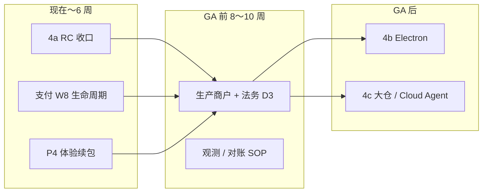

# IDE-4a 之后 — 向下规划（2026-05-25）

> **前置**：IDE-4a（本地盘 + 工具 Agent）已 dogfood 通过。  
> **并行轨道**：D3 GA（2026-10～11）不阻塞本文件中的产品迭代，但 **GA 前必须完成支付 W8～W12**。

---

## 1. 总览：三条线

| 优先级 | 轨道 | 目标 | 建议周期 |
|:------:|------|------|----------|
| **P0** | **4a-RC** | 可对外说的 v1.1：本地盘 + Tool Agent 文档/回归 | 1～2 周 |
| **P0** | **Phase 4 W8** | 取消订阅、到期降级、宽限期（GA 收款质量） | 2～3 周 |
| **P1** | **D3 门禁** | 竞品分 ≥2.2、生产 billing 绿、付费法务 | 至 2026-10 |
| **P2** | **4a 增强** | E2E、撤销、路径护栏、Agent 流式末轮 | 2～4 周（与 P0 并行） |
| **P3** | **4b Electron** | 仅 GA 后且「本机盘」反馈强 | +4～6 周 |
| **P4** | **4c** | 大仓索引 / Cloud Agent / 团队 | GA 后按需 |

**微信 W6～W7**：商户/年龄限制 → **不挡 GA**；GA 可先 **支付宝-only**，微信随商户就绪切换。

---

## 2. 阶段 A — IDE-4a RC 收口（v1.1.0）

**用户故事**：Chrome/Edge 用户打开本机项目 → Agent 多轮改文件 → Diff 确认 → 磁盘同步。

| ID | 任务 | 验收 | 估时 |
|----|------|------|------|
| R1 | 更新 [BROWSER_LIMITATIONS.md](./BROWSER_LIMITATIONS.md) | 工具循环 ✅；写盘 ✅；Safari 降级说明 | 0.5d |
| R2 | [IDE_GAP_CHECKLIST.md](./IDE_GAP_CHECKLIST.md) C7/C8/C9 标完成 | 与代码一致 | 0.5d |
| R3 | RC 公告草稿 | 亮点：本地文件夹 + 工具 Agent（DeepSeek 等） | 1d |
| R4 | Agent 回归清单 | 5 条：读/写/搜索/暂存 Diff/写盘 | 1d |
| R5 | E2E（可选） | Playwright：fixture 目录 + 1 次 `write_file` 断言 | 2～3d |
| R6 | 默认策略 | 工具循环开；`autoApplyWrites` 关；`maxRounds` 10 | 已默认 |
| R7 | 打 tag `v1.1.0-rc` | CHANGELOG 一节 | 0.5d |

**不做（本阶段）**：Electron、Cloud 后台 Agent、全仓向量索引。

---

## 3. 阶段 B — Phase 4 支付（GA 关键路径）

> 详表：[PHASE4_CN_PAYMENT.md](./PHASE4_CN_PAYMENT.md)

| 周 | 里程碑 | 交付 |
|----|--------|------|
| **W8** | B2 前半 | `POST /api/billing/cancel`（或等价）+ 订阅页「取消续费」 |
| **W8** | B2 后半 | 到期 cron/宽限期 3 天 → `plan` 回 `free`；配额回落 |
| **W9** | 欠费策略 | 文档 + UI：Pro 过期后 Chat 提示 |
| **W10～11** | 对账 | 每日 checklist；`billing:reconcile` 运维说明 |
| **W12～14** | 生产切换 | 生产 AppID；`check:release:billing`；小额真单 |

**与 IDE 联动**：支付成功回跳已接订阅弹窗；W8 需在 **SubscriptionModal** 展示「当前周期结束日 / 已取消续费」。

---

## 4. 阶段 C — D3 GA 产品门禁（2026-10～11）

引用 [PLAN_D3_LONGTERM.md](./PLAN_D3_LONGTERM.md) 硬性门禁：

| # | 门禁 | 4a 贡献 | 剩余 |
|---|------|---------|------|
| 1 | 真实订阅闭环 | 支付宝沙箱 ✅ | 生产商户 + W8 |
| 2 | 付费法务 | RC 四页 ✅ | D3 付费条款增补 |
| 3 | 竞品综合 ≥ **2.2** | 4a 拉高 Agent/工作区 | 重跑 [COMPETITOR_SCORE](./COMPETITOR_SCORE_2026-05.md) |
| 4 | 观测 | — | Sentry 或等价 |
| 5 | 运维一页纸 | — | 支付事故 runbook |

**P4 续包（与 GA 并行，不替代 4a）**：

| 项 | 说明 | 优先级 |
|----|------|--------|
| P4-1 索引续包 | 大文件/忽略规则/增量 rebuild | P1 |
| P4-4 Tab 补全 | 编辑器内联建议 | P2 |
| LSP 跳转深化 | IDE-2 延续 | P2 |

---

## 5. 阶段 D — IDE-4a+ 增强（可选，GA 前能做多少做多少）

| ID | 能力 | 说明 |
|----|------|------|
| H1 | **撤销上一批 Agent 写入** | 应用前快照；一键还原 |
| H2 | **路径护栏** | 禁止 `..`、可选禁止写 `.env` |
| H3 | **末轮流式输出** | 仅最后一轮 `sendMessage` stream，工具轮仍非流式 |
| H4 | **本地盘外部变更** | focus 时 refresh 提示（4a-1 L6） |
| H5 | **Agent v1 下线窗口** | 2 周后默认仅工具循环；`VITE_AGENT_LEGACY=1` 保留 Markdown |
| H6 | **配额提示** | Chat 显示「本任务约 N 轮配额」 |

---

## 6. 阶段 E — IDE-4b 桌面（GA 后）

门槛见 [PHASE_IDE4_CURSOR_PARITY.md](./PHASE_IDE4_CURSOR_PARITY.md) §5、[ELECTRON_EVAL.md](./ELECTRON_EVAL.md)：

- P0 生产 7 天无 P0
- 浏览器版「打开本地盘」数据：≥30% 活跃用户尝试过

交付：Electron MVP → 本机 `fs` + 可选本机 `npm`（与 WebContainer 并存）。

---

## 7. 阶段 F — IDE-4c（GA 后按需）

| 方向 | 触发条件 |
|------|----------|
| 大仓索引 | 用户反馈「500 文件不够」 |
| 全仓 embedding 队列 | BYOK 配额产品化 |
| Cloud Agent | 有付费用户愿为后台任务付费 |
| 团队版 | 团队 GA 与审计需求 |

---

## 8. 建议执行顺序（接下来 6 周）

| 周 | 主线 | 副线 |
|----|------|------|
| W1 | R1～R4 Agent/文档 RC 收口 | 竞品评分更新 |
| W2 | R7 v1.1.0-rc 公告 | W8 取消订阅 API |
| W3 | W8 到期降级 + UI | H1 撤销（可选） |
| W4 | W10 对账 SOP | P4-1 索引续包启动 |
| W5～6 | 生产 billing 预演 | E2E 或 H3 流式 |

---

## 9. 决策（沿用 4a，无需重议）

| # | 决策 | 状态 |
|---|------|------|
| D1 | `write_file` 默认 Diff 确认 | ✅ `autoApplyWrites` 默认 false |
| D2 | Agent v2 与 Markdown 并存 | ✅ 设置可关工具循环 |
| D3 | 4a 不阻塞 D3 GA | ✅ |
| D4 | 市场主打「本地盘」 | ✅ 文案优先 |
| D5 | Electron GA 后 | ✅ |

---

## 10. 文档索引

| 文档 | 用途 |
|------|------|
| [NEXT_EXECUTION.md](./NEXT_EXECUTION.md) | 每周勾选任务 |
| [PHASE_IDE4_CURSOR_PARITY.md](./PHASE_IDE4_CURSOR_PARITY.md) | 4a/4b/4c 原始规划 |
| [PHASE4_CN_PAYMENT.md](./PHASE4_CN_PAYMENT.md) | 支付周计划 |
| [PLAN_D3_LONGTERM.md](./PLAN_D3_LONGTERM.md) | GA 里程碑 |
| [BROWSER_LIMITATIONS.md](./BROWSER_LIMITATIONS.md) | 能力边界 |
