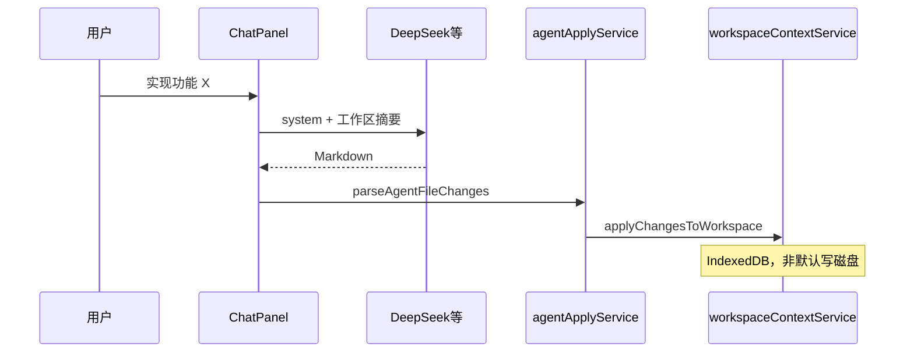
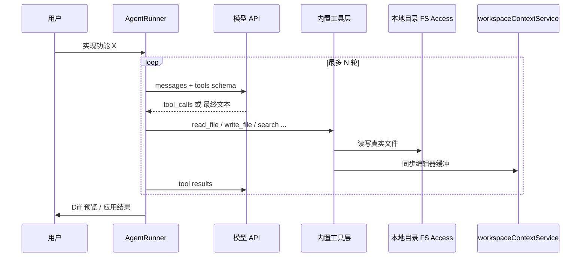

# Phase IDE-4 — Cursor 级 Agent 与工作区（细致规划）

> **版本**：v0.1 · 2026-05-25  
> **前置**：IDE-1 / IDE-2 / IDE-3 基础已完成（见 [IDE_GAP_CHECKLIST.md](./IDE_GAP_CHECKLIST.md)）  
> **并行**：Phase 4 支付（支付宝 ✅）、D3 GA（2026-10～11）不阻塞本轨道启动  
> **定位**：浏览器优先的「轻量 Cursor」+ 可选桌面增强，不追求 VS Code 插件生态 1:1

---

## 1. 目标与成功标准

### 1.1 产品目标（用户可感知）

| # | 目标 | 验收一句话 |
|---|------|------------|
| G1 | 打开**本机项目文件夹**并在 IDE 内编辑 | 改 `src/App.tsx` 后，磁盘文件同步更新 |
| G2 | 对 AI 说「在这个工作区实现 X」能**多轮自主改多文件** | 无需手抄代码块；可见「读了哪些文件 / 改了哪些文件」 |
| G3 | 改动可**预览 Diff、按块接受** | 与现有 Agent Diff 体验一致或更好 |
| G4 | 浏览器版边界**文档化** | 不能做的（调试器、本机 npm）有明确说明与导出路径 |

### 1.2 竞争力指标（对标 Cursor）

| 维度 | IDE-3 后 | IDE-4a 结束 | IDE-4b 结束 |
|------|:--------:|:-------------:|:-------------:|
| Agent / 自动化 | 1.5 | **2.5** | **3.0** |
| 代码库理解 | 1.5 | **2.5** | **3.0** |
| 编辑器 + AI 融合 | 2.0 | **2.8** | **3.2** |
| 综合（主力 IDE） | ~1.8 | **~2.3** | **~2.7** |

评分定义同 [IDE_GAP_CHECKLIST.md](./IDE_GAP_CHECKLIST.md)（0～4）。

### 1.3 非目标（本阶段不做）

- VS Code 扩展兼容、完整 DAP 调试器
- 与 Cursor 相同的云索引 / 后台 30 分钟无人值守 Agent（放到 IDE-5 / 服务端）
- 替换 WebContainer 为唯一运行时（4b 才可选本机终端）

---

## 2. 架构：从「文本解析」到「工具循环」

### 2.1 现状（简要）

### 2.2 目标架构（IDE-4a）

### 2.3 模块划分（新增 / 改造）

| 模块 | 路径（建议） | 职责 |
|------|--------------|------|
| **本地根绑定** | `src/services/localProjectService.ts` | FS Access：打开目录、持久 handle、读/写/列目录 |
| **工具定义** | `src/services/agentTools/definitions.ts` | JSON Schema + 描述 |
| **工具执行** | `src/services/agentTools/executor.ts` | 调用 localProject + workspace + index + terminal |
| **Agent 循环** | `src/services/agentRunner.ts` | 多轮 tool_calls、熔断、日志 |
| **模型适配** | `src/services/aiService.ts` 扩展 | OpenAI-compatible `tools` / `tool_choice` |
| **UI** | `ChatPanel` / `AgentActivityPanel` | 工具时间线、轮次、错误 |
| **兼容层** | `agentApplyService` 保留 | Markdown 解析作 fallback（旧模型 / 无 tools） |

---

## 3. 阶段拆分与时间线

> 假设 **1 名主力前端 + 0.5 后端（API 配额/日志）**，可与支付/GA 并行。  
> 日历为建议，可按人力压缩或顺延。

| 阶段 | 周期 | 主题 | 对外话术 |
|------|------|------|----------|
| **IDE-4a** | 6～8 周 | 本地可写文件夹 + Tool Agent | 「像 Cursor 一样改你电脑上的项目」 |
| **IDE-4b** | +4～6 周 | Electron + 本机终端（可选） | 「桌面版 AI IDE」 |
| **IDE-4c** | +6～8 周 | 规模与云（可选） | 大仓 / 团队 / 后台任务 |

**4a 状态（2026-05-25）**：4a-1～4a-4 **已完成**；向下见 **[PHASE_AFTER_IDE4A.md](./PHASE_AFTER_IDE4A.md)**（RC 收口 → W8 支付 → D3 GA → 4b/4c）。

**原启动顺序**（已走完）：4a-1 本地盘 → 4a-2 工具层 → 4a-3 Agent 循环 → 4a-4 UI/测试。

---

## 4. IDE-4a 工作分解（WBS）

### 4a-1 本地项目绑定（第 1～2 周）

| ID | 任务 | 产出 | 验收 |
|----|------|------|------|
| L1 | 能力检测与降级 | `supportsLocalProject()` | 不支持 FS Access 的浏览器显示说明 + 仅用 IndexedDB |
| L2 | 打开文件夹 UI | 欢迎页 / 工作区面板「打开本地项目」 | 选目录后文件树出现 |
| L3 | 持久化 DirectoryHandle | IndexedDB 存 handle id | 刷新页面可「恢复上次项目」（需用户手势续权） |
| L4 | 目录 → `workspaceContextService` 同步 | 批量 import，保留 path | 与现有工作区面板一致 |
| L5 | **写回磁盘** | `writeLocalFile(path, content)` | Agent/编辑器保存后磁盘 mtime 变化 |
| L6 | 监听外部变更（可选 P1） | 轮询或 focus 时 refresh | 用户在外部改文件，IDE 提示重载 |
| L7 | 限额策略 | 配置：500 文件 / 50MB 警告 | 超大仓提示「仅索引部分」 |

**关键 API**：`FileSystemDirectoryHandle` + `createWritable()`（Chromium/Edge 86+）。

**测试**：手动 + `localProjectService.test.ts`（mock handle）。

---

### 4a-2 内置 Agent 工具（第 2～4 周）

| 工具名 | 参数 | 行为 | 依赖 |
|--------|------|------|------|
| `list_files` | `glob?`, `max?` | 列相对路径，尊重 .gitignore | localProject + index |
| `read_file` | `path`, `start?`, `end?` | 读全文或行范围 | localProject |
| `write_file` | `path`, `content` | 写盘 + 同步 WS + patch index | L5 |
| `search_repo` | `query` | 正则 / 符号索引 | projectIndexManager |
| `run_command` | `cmd`, `cwd?` | WebContainer 终端执行 | terminalBridge |
| `get_diagnostics` | `path?` | 可选：TS 错误摘要 | 二期 |

**原则**：

- 单轮工具总输出上限（如 32KB），防止撑爆 context。
- `write_file` 默认走 **staging**：先 `pendingAgentChanges`，用户确认后再落盘（与现 Diff 一致）；高级设置可「自动应用」。
- 路径一律**相对项目根**，禁止 `..` 逃逸。

**测试**：`agentTools/executor.test.ts` 全覆盖；集成测试用临时目录 fixture。

---

### 4a-3 Agent 循环与模型对接（第 3～5 周）— ✅ 已实现（2026-05-24）

| ID | 任务 | 说明 |
|----|------|------|
| A1 | `sendMessageWithTools()` | 扩展 `aiService.ts`：messages + tools + 解析 `tool_calls` |
| A2 | `agentRunner.run(goal)` | maxRounds=8～12，超时 120s，单轮失败重试 1 次 |
| A3 | 系统 Prompt 模板 | 项目根路径、规则 `.aide/rules.md`、工具使用说明 |
| A4 | DeepSeek / OpenAI / Claude 兼容表 | 文档列各厂商是否支持 tools |
| A5 | Fallback | 无 tool_calls 时回退 `parseAgentFileChanges` |
| A6 | 配额 | 每轮计 1 次 AI 请求或按 token 合并计费（产品决策） |

**DeepSeek**：使用 OpenAI 兼容 `tools` 字段（与现有 chat completions 同 endpoint）。

**后端**：原则上 **工具在浏览器执行**（BYOK Key 不经过服务端读盘）；若未来 Cloud Agent 再增加 `/api/agent/run`。

---

### 4a-4 体验与质量（第 5～6 周）— ✅ 已实现（2026-05-24，E2E 可选待补）

| ID | 任务 | 验收 |
|----|------|------|
| U1 | Agent 活动侧栏或 Chat 内时间线 | 显示 `read_file foo.ts`、`write_file bar.ts` |
| U2 | Composer 模式入口 | 与 Agent 模式合并或二选一（产品定） |
| U3 | 设置项：自动应用 / 需确认、maxRounds | 设置中心持久化 |
| U4 | i18n 中英文 | `agent.tool.*` keys |
| U5 | E2E：`open-local-fixture` → Agent 改 1 文件 → 磁盘 assert | CI 可选 job（需 Chromium） |
| U6 | 文档 | 更新 `BROWSER_LIMITATIONS.md`、`README` 亮点 |

---

## 5. IDE-4b — 桌面增强（可选，+4～6 周）

| ID | 任务 | 参考 |
|----|------|------|
| E1 | Electron 壳 MVP | [ELECTRON_EVAL.md](./ELECTRON_EVAL.md) |
| E2 | `dialog.openDirectory` → 无 100 文件浏览器硬限 |
| E3 | preload IPC：`fs.readFile` / `fs.writeFile` |
| E4 | 可选 spawn 本机 `npm`（与 WebContainer 并存） |
| E5 | 打包 Win/macOS、自动更新（后期） |

**门槛**（与 ELECTRON_EVAL 一致）：P0 生产稳定 + 浏览器版验证「打开本地盘」需求成立。

---

## 6. IDE-4c — 规模与差异化（可选，GA 后）

| 方向 | 内容 |
|------|------|
| 大仓 | 服务端增量索引、懒加载文件树 |
| 向量 | 全仓 embedding 队列（用户 BYOK 或平台配额） |
| Cloud Agent | 后台任务 + 邮件/通知（需计费） |
| 团队 | 共享项目根、权限、审计日志 |
| 差异化 | 国内支付、模板市场、教育版 — 不与 Cursor 正面拼插件 |

---

## 7. 与现有代码的映射（改造清单）

| 现有 | 改造方式 |
|------|----------|
| `workspaceContextService` | 增加 `source: 'indexeddb' \| 'localdisk'`；写操作双写 |
| `ChatPanel` agentMode | 改为调用 `agentRunner`；保留旧路径开关 `VITE_AGENT_LEGACY=1` |
| `aiAgentService` | system prompt 迁入 `agentRunner`；逐步废弃仅 Markdown 指令 |
| `agentApplyService` | 作为 fallback；`write_file` 工具内部可复用 `parseAgentFileChanges` 校验 |
| `fileApplyService` | 统一由 `executor.write_file` 调用 |
| `useProjectIndexSync` | 本地盘变更后 debounce rebuild |
| `mcpAgentBridge` | 保留；内置工具优先，MCP 补充（如 Roblox / 数据库） |

---

## 8. 风险与对策

| 风险 | 影响 | 对策 |
|------|------|------|
| FS Access 仅 Chromium 系 | Safari/Firefox 用户无法写本地盘 | 检测 + 降级 IndexedDB + 推荐 Edge/Chrome；4b Electron 覆盖 |
| 用户拒绝持久权限 | 刷新后需重新选目录 | 「恢复项目」引导一次点击 |
| Tool 循环耗配额 | BYOK 成本上升 | maxRounds、设置项、显示预估轮次 |
| 模型 tool_calls 不稳定 | 写错文件 | 路径白名单 + Diff 确认 + undo |
| 与支付/GA 抢人力 | 延期 | IDE-4a 可一人推进；4b 明确在 GA 后 |
| 安全 | 恶意 prompt 删文件 | 删除/批量写需确认；禁止写 `.env` 外泄（可选规则） |

---

## 9. 里程碑与发布节奏

| 里程碑 | 日期（建议） | 交付物 |
|--------|--------------|--------|
| **M4.0 设计冻结** | +1 周 | 本文档评审通过 + 工具 schema PR |
| **M4.1 本地盘只读** | +2 周 | 打开文件夹 + 树 + 编辑同步（只读可先） |
| **M4.2 本地盘可写** | +3 周 | 保存/Agent 写盘 |
| **M4.3 Tool Agent α** | +5 周 | 内部 dogfood：DeepSeek + 3 工具 |
| **M4.4 IDE-4a RC** | +7 周 | 文档 + E2E + 默认开启 Agent v2 |
| **M4.5 Electron β** | GA 后 | 可选下载页 |

**版本号建议**：`v1.1.0` = IDE-4a RC；`v1.2.0` = IDE-4b 桌面。

---

## 10. 第一周行动清单（可立即开工）

| 天 | 动作 |
|----|------|
| D1 | 评审本文档；确认 4a 范围与不做的项 |
| D2 | 新建 `localProjectService.ts` 骨架 + `supportsLocalProject` |
| D3 | 工作区 UI：「打开本地项目」按钮 + 错误提示 |
| D4 | 读目录灌入 `workspaceContextService`（只读） |
| D5 | `writeLocalFile` 单测 + 手动验证磁盘更新 |
| D6～D7 | 起草 `agentTools/definitions.ts` 与 `executor.ts` 接口（不接 LLM） |

---

## 11. 文档与跟踪

| 文档 | 动作 |
|------|------|
| [IDE_GAP_CHECKLIST.md](./IDE_GAP_CHECKLIST.md) | 增加 Phase IDE-4 节与 C7/C8 条目 |
| [ROADMAP.md](./ROADMAP.md) | 链接本文件 |
| [NEXT_EXECUTION.md](./NEXT_EXECUTION.md) | IDE-4 与 Phase 4 支付并行说明 |
| [BROWSER_LIMITATIONS.md](./BROWSER_LIMITATIONS.md) | 4a 完成后更新「本地文件夹可写」 |

---

## 12. 决策记录（待你确认）

| # | 问题 | 建议默认 | 你的选择 |
|---|------|----------|----------|
| D1 | `write_file` 是否默认要 Diff 确认？ | **要**（安全） |  |
| D2 | Agent v2 是否替换 v1 还是并存？ | 并存 2 周 → 默认 v2 |  |
| D3 | 4a 是否阻塞 D3 GA？ | **不阻塞**（GA 可仍浏览器仓 + 支付宝） |  |
| D4 | 首发推广「本地盘」还是「Tool Agent」？ | **本地盘**（感知更强） |  |
| D5 | Electron 4b 是否在 2026 年内做？ | GA 后视反馈 |  |

确认 D1～D5 后，可将 **M4.0～M4.4** 写入 [OPTIMIZATION_PLAN.md](./OPTIMIZATION_PLAN.md) 的 P4 轨道。
