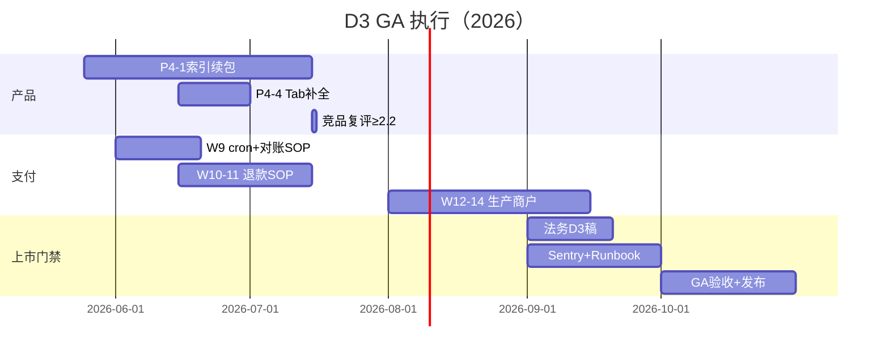

# D3 GA 执行计划（2026-05-25 起）

> **目标**：2026-10～11 **可收款正式上市**（档位 D3）  
> **战略**：[PLAN_STRATEGY_2026_Q3.md](./PLAN_STRATEGY_2026_Q3.md) · [PLAN_D3_LONGTERM.md](./PLAN_D3_LONGTERM.md) · **竞品**：[COMPETITOR_SCORE_2026-05.md](./COMPETITOR_SCORE_2026-05.md)（**~2.35**）

---

## 1. 当前进度（相对 D3 五门禁）

| 门禁 | 状态 | 说明 |
|------|:----:|------|
| 1 支付闭环 | ✅ | 支付宝**生产** Path B + 真单验收（2026-05-26）；微信 ⬜ |
| 2 合规 | 🔶 | RC 四页 ✅；**付费页** `payment.html` ✅（主体待法务） |
| 3 运维 | 🔶 | Sentry 接线 + release ✅；支付告警、Neon 备份 SOP ⬜ |
| 4 产品验收 | 🔶 | 注册→付费→权益 沙箱可走；生产 30min×3 ⬜ |
| 5 体验 ≥2.2 | 🔶 | 复评 **~2.25**（见竞品文档）；P4-1 续包可再拉高 |

**已完成的重大增量（自 5-24）**：

- IDE-4a：本机文件夹 + 工具 Agent（`agentRunner`）
- Phase 4 W8：订阅取消 / 恢复 / 到期降级（3 天宽限期）
- 4a-RC 文档：`RC_ANNOUNCEMENT_IDE4A.md`、回归清单

---

## 2. 时间线（2026-05-25 → GA）



| 阶段 | 周次（参考） | 交付 | 退出标准 |
|------|-------------|------|----------|
| **P0 现在** | W1～2 | 4a 人工回归；`v1.1.0-rc` tag；Vercel 配置 `BILLING_CRON_SECRET` | 清单 8/8 或记录缺陷 |
| **M1 产品** | W3～8 | P4-1 续包 + P4-4；L16 toast 补全 | 竞品复评 ≥ **2.2** |
| **M2 支付沙箱** | 并行 | 微信沙箱（若商户就绪）；集成测扩展 | 双通道沙箱绿 |
| **M3 生产** | W20～24 | 生产 AppID；`check:release:billing`；7 天无 P0 支付事故 | preflight 生产绿 |
| **M4 门禁** | W25～28 | 法务 D3、Sentry、运维一页纸 | LAUNCH_READINESS L19～L24 ✅ |
| **GA** | W29～30 | `v1.0.0` 公告；72h 值班 | D3 检查清单全勾 |

---

## 3. 轨道 A — 产品（GA 前必做 / 应做）

| 优先级 | 任务 | 工时 | 验收 |
|:------:|------|------|------|
| P0 | P4-1 索引续包（增量 rebuild、失败重试、进度 UI） | 🔶 首版已合入 | 千文件可 @ + 语义检索稳定 |
| P1 | P4-4 Tab 补全（防抖、取消 in-flight） | ✅ 首版 | `registerInlineCompletionsProvider` + 缓存 |
| P1 | L16 关键路径错误 toast（支付、工作区、Agent） | 3～5d | 抽样无「静默失败」 |
| P2 | LSP POC（TS/JS 深化）**或** 协作 M1 选型 | 20～30d | 二选一 POC，**不阻塞 GA** |
| — | Electron 4b | — | **GA 后** |

**GA 前明确不做**：Cloud 后台 Agent、VS Code 插件兼容、第三方插件开放上传。

---

## 4. 轨道 B — 商业化（D3 主路径）

| 周 | 任务 | 状态 | 命令/文档 |
|----|------|:----:|-----------|
| W8 | 取消 / 恢复 / 立即降级 | ✅ | `POST /api/subscription/cancel` |
| W8 | 到期 + 3 天宽限期 | ✅ | `billing:expire`、[BILLING_SUBSCRIPTION_LIFECYCLE.md](./BILLING_SUBSCRIPTION_LIFECYCLE.md) |
| W9 | Vercel Cron + `CRON_SECRET` | ✅ | `vercel.json` + GET/POST expire API |
| W9 | 每日对账 checklist | ✅ | [BILLING_RECONCILE_DAILY.md](./BILLING_RECONCILE_DAILY.md) |
| W10 | 退款人工 SOP（1 页） | ✅ | [BILLING_REFUND_SOP.md](./BILLING_REFUND_SOP.md) |
| W6～7 微信 | Native 沙箱 E2E | ⬜ | 不挡 GA（可先支付宝-only） |
| W12～14 | 生产商户 + 真单 | ⬜ | `check:release:billing` |
| GA 前 | `billingPath=B`，关 `devMock` | ⬜ | 生产 env 审计 |

---

## 5. 轨道 C — 合规与运维

| 项 | 交付 | 负责人 | 截止（参考） |
|----|------|--------|-------------|
| 付费隐私/条款 | 价格、自动续费、退款、发票、主体名称 | 法务+产品 | 2026-09 |
| Sentry | `VITE_SENTRY_DSN` + API 错误 | 工程 | 2026-09 |
| 支付告警 | notify 失败 / 对账差异 | 工程 | 2026-09 |
| 运维 SOP | Neon 备份、回滚、incident | 运维 | 2026-10 |
| ICP/备案 | 主域名国内长期运营 | 产品决策 | 视运营 |

---

## 6. GA 发布日检查清单

复制自 [PLAN_D3_LONGTERM.md](./PLAN_D3_LONGTERM.md) §6，随进度勾选：

```text
产品
[ ] 生产：新用户 → 专业版付费 → 配额 5000/日
[ ] 取消订阅 → 宽限期 → 降为 free + Chat 提示
[ ] 退款/争议流程站内可见

技术
[ ] npm run p0:gate
[x] npm run d3:preflight（本地脚本）
[ ] npm run check:release:billing（生产 env）
[ ] npm run smoke:report → 5/5
[ ] 生产无 ALLOW_DEV_BILLING / ALIPAY_SANDBOX

合规
[x] 付费页草案（/legal/payment.html，主体待填）
[ ] 付费条款法务终审（价格与 plans.ts 一致）

运维
[ ] Sentry 测试事件（DSN 配置后）
[ ] billing:expire cron 已配置
[ ] 回滚 tag 就绪
```

---

## 7. 与 Cursor 差距（GA 叙事）

| 我们 GA 时主打 | 不主打（诚实边界） |
|--------------|-------------------|
| 浏览器开箱、BYOK、国内支付宝 | 全语言 LSP、原生调试 |
| 本机文件夹 + 工具 Agent | Cursor Composer 级打磨 |
| 云工作区 + 模板市场 | VS Code 插件生态 |
| 低价 CNY 订阅 | 后台无人值守 Agent |

详见 **[COMPETITOR_SCORE_2026-05.md](./COMPETITOR_SCORE_2026-05.md)** §2026-05-25 复评。

---

## 8. 本周行动（复制到 NEXT_EXECUTION）

1. 跑完 [AGENT_REGRESSION_CHECKLIST.md](./AGENT_REGRESSION_CHECKLIST.md)  
2. Vercel 配置 `BILLING_CRON_SECRET` + `VITE_SENTRY_DSN` + 生产支付宝  
3. `npm run d3:preflight` → [D3_GA_ACCEPTANCE.md](./D3_GA_ACCEPTANCE.md) 沙箱签字  
4. 法务填齐 payment 页运营主体  
5. 微信商户状态 → GA 是否支付宝-only  
