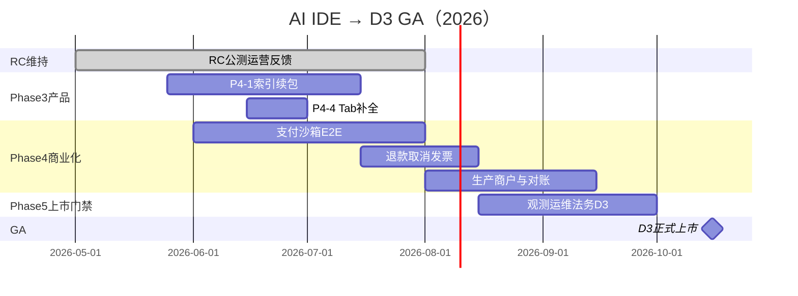

# AI IDE 长期规划 — 以 D3 可收款 GA 为正式上市

> **战略决议（2026-05-24）**  
> - **现在～D3 前**：维持 **RC 公测（路径 A，不收款）**，持续迭代与获客反馈。  
> - **正式上市（GA）**：仅以 **[LAUNCH_READINESS.md](./LAUNCH_READINESS.md) 档位 D3** 为准——真实订阅、支付回调、对账与付费法务。  
> - **D2 MLP**：视为上市前里程碑，**已完成**（2026-05-24），不对外称「正式商业上架」。

**支付决策（已定）**：[PAYMENT_DECISION_CN_2026-05.md](./PAYMENT_DECISION_CN_2026-05.md) · 周计划 [PHASE4_CN_PAYMENT.md](./PHASE4_CN_PAYMENT.md)

**关联**：[PLAN_NEXT_2026.md](./PLAN_NEXT_2026.md) · [CN_PAYMENT_SETUP.md](./CN_PAYMENT_SETUP.md) · [LAUNCH_ASSESSMENT_2026-05.md](./LAUNCH_ASSESSMENT_2026-05.md)

---

## 1. 上市定义（对外怎么说）

| 阶段 | 对内档位 | 对外话术 | 收款 |
|------|----------|----------|------|
| **当前** | D2 RC | 「v1.0.0-rc.1 公测 · BYOK · 云账号可选」 | ❌ |
| **目标** | **D3 GA** | 「正式版上线 · 可订阅专业版/团队版」 | ✅ **支付宝 + 微信（已定）**；Stripe 可选海外 |
| **远期** | D4 | 企业 SSO、SLA、专用部署 | 合同 |

**D3 硬性门禁（缺一不可）**：

1. **支付**：checkout → 异步 notify → `PaymentOrder` / `Subscription` 状态一致；沙箱全绿后再切生产商户。  
2. **合规**：付费版隐私/条款更新（价格、退款、发票、自动续费说明）；运营主体明确。  
3. **运维**：Sentry（或等价）、支付失败告警、Neon 备份策略、回滚发版流程。  
4. **产品**：注册→付费→权益生效 **人工 + 自动化** 验收；欠费/取消策略可执行。  
5. **体验**：竞品综合分 **≥ 2.2**（见 [COMPETITOR_SCORE_2026-05.md](./COMPETITOR_SCORE_2026-05.md)），避免「能付钱但难用」。

---

## 2. 现状基线（2026-05-24）

| 维度 | 状态 |
|------|------|
| 生产 | `ai-ide-flame.vercel.app` smoke **5/5**，云账号可用 |
| 代码 | 路径 B **骨架已有**（checkout、notify、订单查询、集成测 simulate） |
| 法务 | RC 四页（路径 A）✅；**D3 需付费条款增补** |
| 商户 | ⬜ 无生产支付宝/微信/Stripe live |
| 观测 | ⬜ 无生产 Sentry |
| 产品深度 | P4-1 首包 ✅；向量/LSP/协作 GA 级 ⬜ |

---

## 3. 总览时间线（约 20～26 周）

假设 **1 名全职研发 + 产品/法务外包或兼职**。可并行压缩 **2～4 周**。



| 里程碑 | 目标日期（参考） | 标志 |
|--------|------------------|------|
| **M0** | 2026-05 ✅ | D2 RC 闭环 |
| **M1** | 2026-07 中 | P4-1 续包可演示；竞品 ≥ 2.1 |
| **M2** | 2026-08 末 | 支付宝/微信 **沙箱** 端到端绿 |
| **M3** | 2026-09 中 | 生产商户 + `billing:preflight` 生产绿 |
| **M4** | 2026-10 中 | D3 法务签字 + Sentry + 运维一页纸 |
| **GA** | **2026-10～11** | **D3 正式上市公告** |

> 商户审核若显著延误：可推迟 GA 日期；**不**改为 Stripe-first（与决策一致）。

---

## 4. 工作流分解

### 4.1 轨道 A — 产品体验（Phase 3，与支付并行）

**目标**：GA 时用户愿付费，而非「只能演示」。

| 季度 | 交付 | 验收 | 工时粗估 |
|------|------|------|----------|
| **Q2** | **P4-1 续**：向量分片、增量 embedding、索引 UI（进度、失败重试） | 千文件仓库可检索；Chat @ 提及稳定 | 15～20 人日 |
| **Q2** | **P4-4**：Tab 补全防抖、缓存、取消 in-flight | 延迟可感知下降 | 5～8 人日 |
| **Q3** | **二选一**：P4-2 LSP POC（TS/JS）**或** P4-5 协作 M1（信令+在线列表） | 选型文档 + 可演示 | 20～30 人日 |
| **Q3** | 稳定性：大文件/离线/5xx 路径 toast 补全（L16） | 生产抽样 20 用户无阻断 | 5 人日 |

**明确 GA 前不做**：P4-7 Electron、平台 AI 网关、第三方插件上传（无 M2 签名）。

---

### 4.2 轨道 B — 商业化（Phase 4，D3 主路径）

**目标**：`billingPath=B`，`devMock=false`，钱、权、库一致。

| 阶段 | 任务 | 验收命令/动作 |
|------|------|----------------|
| **B1 沙箱** | 配置支付宝沙箱 + 微信沙箱；`APP_URL` / `PAYMENT_NOTIFY_URL`（ngrok） | `npm run billing:preflight`；集成测扩展真实 notify 回放 |
| **B1** | UI：订阅弹窗价格与 [plans.ts](../lib/billing/plans.ts) 一致；支付成功回跳 `?subscription=success` | 人工：专业版付款→刷新→配额变 Pro |
| **B2 业务** | 取消订阅、到期降级、宽限期（书面策略 → 代码） | 取消后 `cancelAtPeriodEnd`；到期回 free |
| **B2** | 退款流程（至少：人工+后台脚本；理想：支付宝/微信退款 API） | [L20](./LAUNCH_READINESS.md) 勾选 |
| **B3 生产** | 生产商户密钥仅 Vercel Production；`verify-env --require-cn-billing` | `check:release:billing` 绿 |
| **B3** | 对账：每日 `PaymentOrder` 与商户后台核对脚本或 checklist | 运维 SOP 一页 |
| **B3** | Stripe live（可选海外） | webhook 生产 URL 绿 |

**支付路线（2026-05-24 已确认）**：**国内支付宝 + 微信优先** — 见 [PAYMENT_DECISION_CN_2026-05.md](./PAYMENT_DECISION_CN_2026-05.md)。Stripe 不阻塞 GA。

---

### 4.3 轨道 C — 合规与运营（Phase 5）

| 项 | RC 已有 | D3 需增补 |
|----|---------|-----------|
| 隐私/条款 | 路径 A 四页 | 价格、自动续费、退款、发票、争议解决、运营主体名称 |
| 备案/ICP | — | 主域名长期国内运营时产品决策 |
| 观测 | health | `VITE_SENTRY_DSN` + 支付失败率告警 |
| 运维 | — | Neon 备份、回滚、incident 联系人（L23～L24） |
| 安全 | P0' 基线 | 商户密钥轮换、admin 脚本审计、年度渗透（可选） |

**工时**：法务 3～5 人日（外部律师另计）；工程 5～8 人日（Sentry + runbook）。

---

### 4.4 轨道 D — RC 期运营（持续，不阻塞开发）

| 活动 | 频率 | 目的 |
|------|------|------|
| GitHub Issues 分类 | 每周 | 收敛 GA 前必改 bug |
| 公测公告/更新日志 | 里程碑 | 见 [RC_ANNOUNCEMENT_2026-05.md](./RC_ANNOUNCEMENT_2026-05.md) |
| 轻量指标 | 双周 | 注册数、云工作区数、AI 日活（Neon/Vercel 日志） |
| 用户访谈 | 每月 3～5 人 | 验证付费意愿与定价 |

---

## 5. 分阶段详细计划

### Phase 3 — 产品深度（约 10 周，2026-05-25 ～ 2026-08-01）

| 周 | 焦点 | 交付物 |
|----|------|--------|
| W1～W2 | P4-1 设计 | 分片策略、embedding 批处理、UI 进度条 |
| W3～W5 | P4-1 实现 | 增量索引、语义检索生产可用 |
| W6 | P4-4 | Tab 补全体验 |
| W7～W8 | 稳定 + 竞品复评 | ≥ 2.1；修复 Top Issues |
| W9～W10 | 缓冲 / LSP 或协作选型 | 书面选型 + POC 启动（不阻塞支付） |

**退出标准**：M1——索引续包可对外演示；无 P0 级生产事故。

---

### Phase 4 — 支付闭环（约 12 周，2026-06-01 ～ 2026-08-31，与 Phase 3 重叠）

| 周 | 焦点 | 交付物 |
|----|------|--------|
| W1～W2 | 商户调研 | 支付宝/微信开通时间表；Stripe 是否并行 |
| W3～W5 | B1 沙箱 | 沙箱 E2E；扩展 `test:integration` 支付用例 |
| W6～W7 | B2 订阅生命周期 | 取消、到期、宽限期、UI 与 API 一致 |
| W8 | B2 退款 MVP | 人工流程 + 文档；或 API 对接 |
| W9～W10 | B3 生产商户 | Vercel 生产 env；`billing:preflight` 绿 |
| W11～W12 | 对账 + 压测 | 支付回调幂等；重复 notify 测试 |

**退出标准**：M2 沙箱绿；M3 生产商户绿 + 连续 7 天无 P0 支付事故。

---

### Phase 5 — D3 上市门禁（约 6 周，2026-09-01 ～ 2026-10-15）

| 周 | 焦点 | 交付物 |
|----|------|--------|
| W1 | 法务 D3 稿 | 更新四页 + 付费说明页 |
| W2 | Sentry + 告警 | 前端+API 错误可见 |
| W3 | 运维 SOP | 备份、回滚、支付事故 runbook |
| W4 | GA 验收 | `p0:gate` + 支付全链路 30min × 3 场景 |
| W5 | 文案与定价冻结 | CHANGELOG `v1.0.0`；README 去 RC 字样 |
| W6 | **GA 发布** | 公告、监控值班 72h |

**退出标准**： [LAUNCH_READINESS.md](./LAUNCH_READINESS.md) L1～L24 中 D3 相关项全部 ✅。

---

## 6. D3 GA 发布日检查清单（可复制）

```text
产品
[ ] 沙箱+生产各走通：新用户 → 专业版付费 → 配额生效
[ ] 取消订阅 → 周期结束降级
[ ] 退款/争议流程文档在站内可访问

技术
[ ] npm run p0:gate
[ ] npm run check:release:billing
[ ] smoke:report 5/5
[ ] ALLOW_DEV_BILLING 未设置；devMock=false

合规
[ ] 付费条款律师签字（或书面确认）
[ ] 价格页与实际扣款一致

运维
[ ] Sentry 收到测试事件
[ ] 支付 notify 失败有告警路径
[ ] 回滚版本 tag 已打
```

---

## 7. 资源与风险

### 7.1 人力假设

| 角色 | 投入 | 说明 |
|------|------|------|
| 全栈研发 | 1 FTE | 主责 A+B 轨道 |
| 产品/运营 | 0.2～0.3 | 定价、公告、用户反馈 |
| 法务 | 外部 | D3 付费条款必审 |
| 商户开通 | 运营 | 支付宝/微信往往 2～4 周审核 |

### 7.2 风险登记

| 风险 | 影响 | 缓解 |
|------|------|------|
| 国内商户迟迟不下发 | GA 推迟 1～2 月 | Stripe 海外先行；或延长 RC |
| 支付回调丢单 | 用户付了未升级 | 幂等 + 订单补单脚本 + 人工核对 |
| 竞品叙事弱 | 付费转化低 | Phase 3 索引/补全；诚实定位 BYOK+国内支付 |
| 单人瓶颈 | 排期滑移 | Phase 3/4 并行不超过 2 个主项 |
| WebContainer 限制 | 差评 | 不承诺原生调试；文档前置 |

---

## 8. 版本与营销节奏

| 版本 | 时间（参考） | 内容 |
|------|--------------|------|
| v1.0.0-rc.1 | 2026-05 ✅ | RC 公测，路径 A |
| v1.0.0-rc.2～3 | 2026-06～07 | 索引、补全、修复 |
| v1.0.0-beta.1 | 2026-08 | 沙箱付费内测（小范围邀请） |
| **v1.0.0** | **GA** | D3 正式版，路径 B 生产 |

**GA 公告要点**：可订阅、价格透明、退款说明、BYOK 仍支持、云工作区与配额表。

---

## 9. 与现有文档的分工

| 文档 | 用途 |
|------|------|
| **本文** | 长期路线图与季度节奏 |
| [NEXT_EXECUTION.md](./NEXT_EXECUTION.md) | 当前 2～4 周冲刺任务 |
| [PHASE3_KICKOFF.md](./PHASE3_KICKOFF.md) | Phase 3 立即项 |
| [DEPLOY_CHECKLIST.md](./DEPLOY_CHECKLIST.md) | 每次发版 |
| [AUTH_BILLING_QA.md](./AUTH_BILLING_QA.md) | 人工 QA 模板 |

---

## 10. 立即行动（未来 2 周）

1. **支付宝沙箱 AppID**：按 [CN_MERCHANT_APPLY_CHECKLIST.md](./CN_MERCHANT_APPLY_CHECKLIST.md) 申请。  
2. **`npm run billing:preflight`** + **`npm run payment:notify-urls`**。  
3. **Phase 4 W3**：支付宝沙箱 E2E — [PHASE4_CN_PAYMENT.md](./PHASE4_CN_PAYMENT.md)。  
4. **并行 Phase 3**：P4-1 索引续包。  
5. **RC 运营**：收集付费反馈；GA 前冻结 ¥19/¥49 是否调价。

---

**总结**：**现在 = RC（D2）**；**正式上市目标 ≈ 2026 年 10～11 月（D3）**，前提是商户与付费法务按时到位；期间用 Phase 3 拉高产品力，用 Phase 4 打通收钱闭环。
