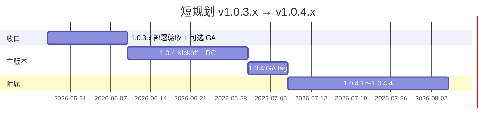

# 短规划 — v1.0.3.x → v1.0.4.x（约 8～16 周）

> **范围**：仅 **1.0.3 世代收尾** + **1.0.4 主版本** + **1.0.4.x 四级附属**  
> **不含** v1.1 能力世代（见 [ROADMAP_V1.1.md](./ROADMAP_V1.1.md)）  
> **竞品锚点**：当前 **~2.75**（[COMPETITOR_COMPARISON_V1.0.2.md](./COMPETITOR_COMPARISON_V1.0.2.md)）→ 1.0.4 收官目标 **~2.80**

---

## 0. 当前基线（2026-05-27）

| 世代 | 状态 | tag / 版本 |
|------|:----:|------------|
| 1.0.2.x 能力 | ✅ | 至 `v1.0.2.7`（Diff/FIM/索引/Agent/桌面） |
| **1.0.3.x 运营稳定化** | 🔶 **S5 终章** | **`v1.0.3.5`**（[V1.0.3.5_EXECUTION.md](./V1.0.3.5_EXECUTION.md)） |
| **1.0.3 主版本 GA** | 🔶 可选 | `v1.0.3` + `VITE_GA_LIVE=true` |
| **1.0.4** | ✅ **GA** | [V1.0.4_GA_EXECUTION.md](./V1.0.4_GA_EXECUTION.md) · 竞品 **~2.80** |
| **1.0.4.x** | ⏳ **进行中** | [V1.0.4.x_MASTER_PLAN.md](./V1.0.4.x_MASTER_PLAN.md) → **1.0.4.4 收官** |

**1.0.2.x 已交付的「IDE-5」能力**（勿在 1.0.4 重复立项）：块级 Diff、Tab FIM、索引 500/2000、`grep_repo`、tasks.md、Win+Mac 桌面。见 [PLAN_IDE5_AND_COMPETITORS.md](./PLAN_IDE5_AND_COMPETITORS.md)。

---

## 1. 短规划总览（时间线）

| 阶段 | 版本 | 周期（估） | 主题 |
|------|------|:----------:|------|
| **A** | 1.0.3.x 收尾 | 1～2 周 | 部署对齐、可选 `v1.0.3` GA、运营闭环 |
| **B** | **1.0.4** 主版本 | 3～4 周 | **体验第二档对外叙事**（非功能大爆炸） |
| **C** | **1.0.4.1～1.0.4.4** | 4～6 周 | MCP/感知/语义/i18n/发布收官 |

---

## 2. 阶段 A — 1.0.3.x 收口（必做）

> 清单：[ROADMAP_V1.0.3.x.md](./ROADMAP_V1.0.3.x.md) · 执行：[NEXT_EXECUTION.md](./NEXT_EXECUTION.md)

| ID | 任务 | 验收 |
|----|------|------|
| A-1 | Vercel 部署后 `health.version` = **1.0.3.5** | `npm run rc:live-spotcheck` 无版本 warn |
| A-2 | 人工 5 项 live 抽测勾选 | [RC_LIVE_SPOTCHECK_LAST.md](./RC_LIVE_SPOTCHECK_LAST.md) |
| A-3 | `VITE_SENTRY_DSN` + `CRON_SECRET` + 对账 1 轮 | `ops:verify-p1` / [BILLING_RECONCILE_DAILY.md](./BILLING_RECONCILE_DAILY.md) |
| A-4 | 发布 ≥2 渠道 | [publish/README.md](./publish/README.md) |
| A-5 | 关闭 GitHub **1.0.3.x** milestone | — |
| A-6 | **可选** `v1.0.3` GA：`VITE_GA_LIVE=true` + tag | [V1.0.3_KICKOFF.md](./V1.0.3_KICKOFF.md) Phase 3 |

**退出标准**：生产 smoke 5/5 + spotcheck 自动项全绿 + 运维三项有记录。

---

## 3. 阶段 B — v1.0.4 主版本（Kickoff）

### 3.1 一句话定位

**1.0.4** = 在 **1.0.2 能力 + 1.0.3 运营** 之上的 **「智能体验巩固版」**：

- 把已交付的 Diff/FIM/索引/Agent **产品化**（设置 UI、文档、默认策略）  
- 补齐 **MCP 官方目录深化**、**活动行/终端上下文**（Cascade **入门**，非全感知）  
- 竞品综合分 **2.75 → ~2.80**（仍低于 Cursor ~3.6）

**不是**：后台 30min Agent、VSIX、全语言 DAP、Kiro Hooks。

### 3.2 Must / Should（主版本）

| 类型 | 交付 | 验收 |
|------|------|------|
| **Must** | GitHub Release **`v1.0.4`** | Web + Win + Mac |
| **Must** | `go-live:preflight` 全绿 | 本地 + smoke 5/5 |
| **Must** | 竞品文档更新 **~2.80** | [COMPETITOR_COMPARISON_V1.0.2.md](./COMPETITOR_COMPARISON_V1.0.2.md) 修订 |
| **Should** | `.aide/rules.md` **设置中心可编辑** | [IDE_GAP_CHECKLIST.md](./IDE_GAP_CHECKLIST.md) C4 |
| **Should** | MCP：≥3 个官方 Server 预置 + 连通 smoke | [PHASE_IDE4_CURSOR_PARITY.md](./PHASE_IDE4_CURSOR_PARITY.md) |
| **Should** | Agent **活动行**展示最近编辑/终端摘要（只读注入） | 文档诚实边界 |
| **Could** | 语义检索「一键开启」引导（BYOK embedding） | 设置页开关 |

### 3.3 非目标（留 1.0.4.x 或 v1.1）

| 非目标 | 去向 |
|--------|------|
| Background / Cloud Agent | **v1.1** |
| Tab++ / 全感知 Cascade | **v1.1+** 或不做 |
| VSIX / DAP | 不做 |
| 微信 live | 仍不接，除非单独立项 |

### 3.4 里程碑（建议）

| 周 | 交付 |
|----|------|
| W0 | [V1.0.4_MASTER_PLAN.md](./V1.0.4_MASTER_PLAN.md) + [V1.0.4_KICKOFF.md](./V1.0.4_KICKOFF.md) ✅ |
| W1 | rules UI + MCP 目录 |
| W2 | 活动行/终端上下文 + RC |
| W3 | **`v1.0.4`** tag、Release、公告 |

---

## 4. 阶段 C — 1.0.4.x 四级附属

> **总规划**：[V1.0.4.x_MASTER_PLAN.md](./V1.0.4.x_MASTER_PLAN.md) · **详表**：[ROADMAP_V1.0.4.x.md](./ROADMAP_V1.0.4.x.md)  
> **说明**：**1.0.4 GA 已并入 E1+E2 主体**；四级剩余为 **深化（.1/.2）+ 检索（.3）+ 收官（.4）**。

| 版本 | 代号 | 主题 | 关键交付 |
|:----:|------|------|----------|
| **1.0.4.1** | **E1′ MCP 深化** | 生产 smoke、FAQ、竞品 MCP 终验 | [V1.0.4.1_EXECUTION.md](./V1.0.4.1_EXECUTION.md) |
| **1.0.4.2** | **E2′ 感知深化** | 手测、非 Cascade 话术、Agent 说明 | [V1.0.4.2_EXECUTION.md](./V1.0.4.2_EXECUTION.md) |
| **1.0.4.3** | **E3 检索** | 语义/@ onboarding、索引设置卡片、i18n | [V1.0.4.3_EXECUTION.md](./V1.0.4.3_EXECUTION.md) · [SEMANTIC_SEARCH_ONBOARDING.md](./SEMANTIC_SEARCH_ONBOARDING.md) |
| **1.0.4.4** | **E4 收官** | publish、live 5/5、milestone、**2.80 终稿** | [V1.0.4.4_EXECUTION.md](./V1.0.4.4_EXECUTION.md) |

**合并 tag**：`v1.0.4.2`（.1+.2）· `v1.0.4.4`（.3+.4）  
**世代结束**：**1.0.4.4** 后 → [ROADMAP_V1.1.md](./ROADMAP_V1.1.md)

---

## 5. 评分路线图（短规划内）

| 时点 | AI IDE 目标分 | 主要拉近 |
|------|:-------------:|----------|
| 现在（1.0.4 GA） | **~2.80** | MCP、rules、感知（初评） |
| **1.0.4.4 收官** | **~2.80 固化** | E3 检索 UX、live 入档 |
| Cursor（参照） | 3.6 | 仍差 **~0.8** |

---

## 6. 文档与发包习惯

| 文档 | 用途 |
|------|------|
| [VERSIONING.md](./VERSIONING.md) | `1.0.4` / `1.0.4.N` 约定 |
| [V1.0.4_KICKOFF.md](./V1.0.4_KICKOFF.md) | 执行 checklist |
| [ROADMAP_V1.0.4.x.md](./ROADMAP_V1.0.4.x.md) | 四级详表 |
| [NEXT_EXECUTION.md](./NEXT_EXECUTION.md) | 当前周任务 |

每附属：`CHANGELOG [1.0.4.N]` + `go-live:preflight` + tag `v1.0.4.N`。

---

## 7. 与长规划衔接

**1.0.4.x 收官后** → 进入 [ROADMAP_V1.1.md](./ROADMAP_V1.1.md)（后台 Agent、协作 M1、网关等）。  
**不要在 1.0.4 主版本塞 v1.1 能力**，避免延期与竞品话术失真。
