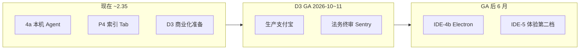

# 战略方案 2026 Q3 — Cursor 对比后的下一阶段

> **日期**：2026-05-26  
> **前提**：本地验收无问题（Agent、订阅链路、`test:local` 全绿）  
> **竞品**：[COMPETITOR_SCORE_2026-05.md](./COMPETITOR_SCORE_2026-05.md)（综合 **~2.35**，Cursor **~3.6**；四竞品矩阵见 [COMPETITOR_MATRIX_2026-05.md](./COMPETITOR_MATRIX_2026-05.md)）  
> **原则**：不追平 Cursor；做 **「国内可付费的浏览器 Cursor 入门版」**，GA 后再用桌面版拉高上限。

---

## 1. 战略一句话

**对外**：打开浏览器就能用 AI 改你电脑上的项目，人民币订阅，API Key 自己带。  
**对内**：先 **D3 收钱**，再 **4b 桌面**，再 **5 索引/Tab 第二档**；绝不并行开 VS Code 兼容或全语言调试。

---

## 2. Cursor 差距 → 我们的三条战线

| 战线 | 对标 Cursor 什么 | 目标 | 不做什么 |
|------|------------------|------|----------|
| **① 商业化（D3）** | 支付成熟度 | 能收款、能退款、能到期 | Stripe-first、自动续费银行卡 |
| **② 桌面（4b）** | 终端 + 大仓 | 本机 shell、>500 文件、可选免 FS API 限额 | 完整 DAP |
| **③ 智能（5）** | Composer / Tab++ / 索引 | 块级 apply、FIM Tab、2k 文件索引 | 云后台 30min Agent |

---

## 3. 阶段规划（新方案）

### 阶段 0 — 收口 D3（现在 → GA，约 8～12 周）

**目标**：从「能演示收钱」到「生产可收钱」。

| 优先级 | 任务 | 验收 | 负责 |
|:------:|------|------|------|
| P0 | Vercel 生产支付宝 + `check:release:d3` | 真单开通 Pro 30 天 | 你 + 商户 |
| P0 | 法务填 `payment.html` 主体 | 合规门禁签字 | 法务 |
| P0 | `VITE_SENTRY_DSN` + 测试事件 | Issues 可见 | 工程 |
| P1 | `v1.0.0` GA 公告 + CHANGELOG | 对外话术 D3 | 产品 |
| P1 | 72h 值班 Runbook | 支付/expire 告警有人看 | 运维 |
| — | 微信 live | 有商户再做；无则 **支付宝-only GA** | 决策 |

**退出标准**： [D3_GA_ACCEPTANCE.md](./D3_GA_ACCEPTANCE.md) 生产段全勾 + `smoke:report` 5/5。

---

### 阶段 1 — IDE-4b 桌面增强（GA 后 0～4 月）

**目标**：综合分 **2.35 → ~2.55**；攻克 Cursor 差距表里的 **终端（大）** 和 **500 文件（中）**。

| ID | 交付 | 验收 | 工时（估） |
|----|------|------|------------|
| 4b-1 | Electron 壳 + 复用现有 Web UI | Win/mac 安装包可打开项目 | 3～4 周 |
| 4b-2 | Node 子进程终端（非 WebContainer） | `npm run dev` 在 IDE 内可跑 | 2～3 周 |
| 4b-3 | 本机递归读盘（绕过 FS Access 上限） | 2000 文件项目可索引 | 2 周 |
| 4b-4 | 自动更新 + 崩溃上报 | Sentry release 对齐 | 1 周 | ✅ 4b-5 |

**非目标**：VS Code 插件、系统级 Git GUI 替代。

**营销句**：「下载版：大项目 + 真终端，AI Agent 与网页版相同。」

---

### 阶段 2 — IDE-5 智能第二档（GA 后 4～9 月）

> 详细 WBS + 与 Kiro/Windsurf 映射：[PLAN_IDE5_AND_COMPETITORS.md](./PLAN_IDE5_AND_COMPETITORS.md)

**目标**：综合分 **~2.55 → ~2.75**；缩小 **Tab++、Composer Diff、@ 检索** 差距，仍不碰后台 Agent。

| ID | 交付 | 对标 Cursor | 验收 |
|----|------|-------------|------|
| 5-1 | 块级 Diff + 按 hunk 接受/拒绝 | Composer apply | Agent 改 3 文件可逐块确认 |
| 5-2 | Tab FIM（fill-in-middle）或专用小模型 | Copilot++ | 多行补全主观「跟手」 |
| 5-3 | 索引：后台 Worker + 断点续建 | 云索引 lite | 2k 文件 @ 稳定 <5s |
| 5-4 | 工具扩展：`grep` `run_terminal_cmd`（桌面） | 内置工具链 | Agent 可跑测试命令 |
| 5-5 | L16 全路径 toast | — | 支付/工作区/Agent 无静默失败 |

**非目标**：全语言 LSP、MCP 市场开放上传。

---

### 阶段 3 — 2027 可选（竞品达 ~3.0 时）

- 服务端 **后台任务队列**（改仓 ≤15min，非 Cursor 30min 对标）  
- 协作 M1：共享只读工作区链接  
- 企业版：SSO、审计日志（D4）

---

## 4. 与 Cursor / Kiro / Windsurf 并排的对外叙事（GA 时用）

|  | **Cursor** | **Windsurf** | **Kiro** | **AI IDE** |
|--|------------|--------------|----------|------------|
| **安装** | 桌面 | 桌面 | 桌面 + CLI | **浏览器优先**，可选桌面 |
| **Agent** | Composer | Cascade | Spec + Hooks | 工具 Agent |
| **价格** | USD Pro | ~$10 Pro | AWS 积分 | **¥19 / ¥49 支付宝** |
| **模型** | 平台 | 多模型套餐 | Bedrock | **BYOK** + 配额 |
| **适合** | 专业全栈 | Agent 重度 | AWS 企业 | 国内个人/小仓/课堂 |

**不要说**：「比 Cursor 更强」  
**要说**：「入门 Agent + 国内付费 + 浏览器开箱；桌面版补大仓与真终端。」

（完整矩阵：[COMPETITOR_MATRIX_2026-05.md](./COMPETITOR_MATRIX_2026-05.md)）

---

## 5. 资源与节奏（1 人主力假设）

| 季度 | 主线 | 并行上限 |
|------|------|----------|
| **2026 Q3** | D3 GA 商户 + 运维 | 仅修 P0 bug，不加 4b |
| **2026 Q4** | IDE-4b Electron | 5-5 toast 可穿插 |
| **2027 Q1** | IDE-5 块级 Diff + Tab FIM | 二选一先行（建议先 5-1） |

若商户审核拖期：**GA 日期顺延**，不砍 4b；继续 RC 获客 + BYOK。

---

## 6. .metrics（每月看一眼）

| 指标 | 现在 | GA 目标 | GA+6 月 |
|------|------|---------|---------|
| 竞品综合分 | ~2.35 | ≥2.2 | ~2.75 |
| 与 Cursor 分差 | −1.25 | −1.2 | −0.85 |
| 生产付费转化 | — | 有首单 | 留存 / 续费率 |
| Agent 成功率 | 本地 ✅ | 生产 ≥90% 轮次 | 同上 |
| 索引 P95（1k 文件） | 未测 | <10s | <5s |

---

## 7. 本周行动（从「本地无问题」到「方案落地」）

1. **定 GA 日期窗口**（默认 2026-10～11，写入日历）  
2. **开商户工单**（支付宝生产；微信仅跟踪）  
3. **Vercel Production env 清单** → [DEPLOY_D3_GA.md](./DEPLOY_D3_GA.md) 逐项打勾  
4. **冻结 GA 范围**：4b/5 **不进 GA**；GA 仅 D3 + 文档 + 观测  
5. **4b 预研**（可选）：`electron-vite` POC 1 天，验证打包体积与 COOP 头  

---

## 8. 文档索引

| 文档 | 用途 |
|------|------|
| [PLAN_D3_GA_EXECUTION.md](./PLAN_D3_GA_EXECUTION.md) | GA 前每周任务 |
| [PLAN_D3_LONGTERM.md](./PLAN_D3_LONGTERM.md) | D3 门禁定义 |
| [PHASE_AFTER_IDE4A.md](./PHASE_AFTER_IDE4A.md) | 4a 完成后路径 |
| [PHASE_IDE4_CURSOR_PARITY.md](./PHASE_IDE4_CURSOR_PARITY.md) | 4a/4b 技术 WBS |
| [COMPETITOR_SCORE_2026-05.md](./COMPETITOR_SCORE_2026-05.md) | 竞品分（本文同步） |
| [COMPETITOR_MATRIX_2026-05.md](./COMPETITOR_MATRIX_2026-05.md) | Cursor / Kiro / Windsurf 四竞品矩阵 |
| [PLAN_IDE5_AND_COMPETITORS.md](./PLAN_IDE5_AND_COMPETITORS.md) | IDE-5 WBS + 竞品映射 |
| [NEXT_EXECUTION.md](./NEXT_EXECUTION.md) | 当前周执行 |

---

## 9. 决策点（请你确认）

| # | 问题 | 建议默认 |
|---|------|----------|
| 1 | GA 是否 **支付宝-only**（微信未就绪） | **是** |
| 2 | GA 是否包含 **Electron** | **否**（GA+3 月） |
| 3 | GA 后优先 **4b 桌面** 还是 **5 Tab/Diff** | **4b**（分差最大在终端） |
| 4 | 目标竞品分 GA+6 月 | **~2.75**（不追 3.6） |

确认后可将 §7 抄进 [NEXT_EXECUTION.md](./NEXT_EXECUTION.md) 作为新一周 P0。
