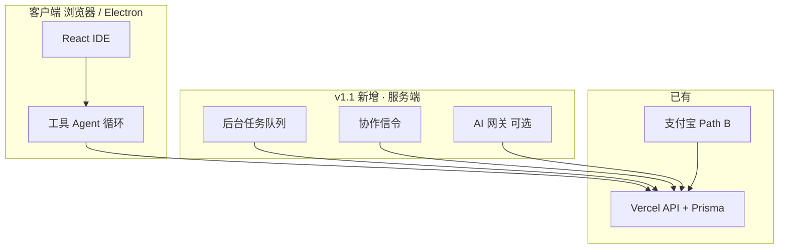

# 长远规划 — v1.1 世代（2026 H2 ～ 2027）

> **范围**：**1.0.5 桥接之后** 至 **v1.1.x 稳定运营**（前置：[V1.0.5_MASTER_PLAN.md](./V1.0.5_MASTER_PLAN.md)）  
> **短规划**（仅 1.0.3.x～1.0.4.x）：[PLAN_SHORT_V1.0.3-V1.0.4.md](./PLAN_SHORT_V1.0.3-V1.0.4.md)  
> **草案占位**：[V1.1_RFC_STUB.md](./V1.1_RFC_STUB.md)  
> **战略背景**：[PLAN_STRATEGY_2026_Q3.md](./PLAN_STRATEGY_2026_Q3.md) · [PLAN_IDE5_AND_COMPETITORS.md](./PLAN_IDE5_AND_COMPETITORS.md)

---

## 1. 定位（相对 1.0.4）

| 世代 | 角色 | 竞品分（估） |
|------|------|:------------:|
| 1.0.2.x | **能力奠基**（Diff/FIM/索引/Agent/桌面） | → 2.75 |
| 1.0.3.x | **运营稳定化**（观测/域名/计费/发布） | 维持 2.75 |
| **1.0.4.x** | **体验巩固**（MCP/感知入门/语义引导） | **~2.80** |
| **v1.1** | **能力第二代际**（服务端 Agent、协作、网关） | **~2.85～3.0** |
| Cursor 参照 | 全栈专业 IDE | **~3.6** |

**v1.1 一句话**：在「浏览器 Cursor 入门版 + 国内付费」已站稳后，用 **服务端能力** 拉开与纯前端的差距，仍 **不** 做 VS Code 替代。

---

## 2. 战略原则（长远不变）

1. **可赢**：浏览器 + CNY + BYOK + 工具 Agent 入门 + 开源。  
2. **不追**：VSIX、全语言 DAP、Tab++ 全量、Kiro Spec/Hooks 全链路。  
3. **有选择地追**：后台任务队列、协作信令、平台 Key 网关、单语言 LSP 深化。  
4. **诚实话术**：不说替代 Cursor/Windsurf/Kiro；说「国内场景 + 入门 Agent + 可选无人值守（v1.1）」。

---

## 3. v1.1 目标架构（示意）

---

## 4. 主版本 v1.1.0 — 四大支柱

### 4.1 P1 — 后台 Agent 队列（最高优先级）

| 项 | 说明 |
|----|------|
| **用户价值** | 对标 Cursor Cloud Agent / Kiro Cloud Agent **入门**：离开页面仍可跑一批工具步骤 |
| **范围** | 单用户队列、单仓库、**≤15～30min**、可取消；结果回写工作区或生成 PR 链接（可选） |
| **依赖** | 服务端 Worker/Cron、任务表、沙箱（桌面 spawn 或容器）、计费档位 |
| **非目标** | 多租户企业审计、跨仓库无人值守数小时 |

**验收**：提交任务 → 关闭标签页 → 回来看到 Diff 队列或完成通知。

### 4.2 P2 — 协作 M1（信令稳定）

| 项 | 说明 |
|----|------|
| **现状** | WebRTC Beta，无稳定信令 |
| **M1** | 房间创建/加入、权限（只读/编辑）、断线重连；**仍非** Google Docs 级 OT |
| **依赖** | WebSocket 或托管 SFU（Livekit 等）、`collaborationService` 重构 |

**验收**：2 人同房间编辑 10 分钟无丢房间；冲突策略文档化。

### 4.3 P3 — AI 网关（可选 / Pro+）

| 项 | 说明 |
|----|------|
| **用户价值** | 无 API Key 也能试用；平台统一计费与风控 |
| **范围** | 按套餐配额转发至 DeepSeek/通义等；**BYOK 仍保留** |
| **依赖** | 模型路由、用量、密钥托管策略、成本模型 |

**验收**：Pro 用户可选用「平台额度」完成 Chat；超额回退 BYOK 或 429。

### 4.4 P4 — i18n Phase 2

| 项 | 说明 |
|----|------|
| **范围** | 日文（或东南亚一门）+ 设置/计费/Agent 弹窗 100% 覆盖 |
| **依赖** | [I18N_STATUS.md](./I18N_STATUS.md) 缺口清单 + E2E 冒烟 |

---

## 5. v1.1.x 稳定化（GA 后第四段，规划）

| 版本 | 主题（草案） |
|------|----------------|
| **1.1.1** | 队列观测 + Sentry + Cron |
| **1.1.2** | 协作 M1 生产信令 + 域名 |
| **1.1.3** | 网关计费与对账 |
| **1.1.4** | 发布收官 + 竞品复评 **~2.90** |

> 具体 ID 在 v1.1.0 Kickoff 时拆 `ROADMAP_V1.1.x.md`（待建）。

---

## 6. 时间线（长远 · 示意）

| 时期 | 里程碑 | 备注 |
|------|--------|------|
| **2026 Q2** | 1.0.3.4 ✅ · 短规划 A 段 | 当前 |
| **2026 Q2～Q3** | 1.0.4 GA + 1.0.4.4 | [PLAN_SHORT_V1.0.3-V1.0.4.md](./PLAN_SHORT_V1.0.3-V1.0.4.md) |
| **2026 Q3** | v1.1 RFC 评审 + 队列 PoC | GitHub Discussion |
| **2026 Q4** | **v1.1.0-rc** | 队列 + 协作二选一先 GA |
| **2027 Q1** | **v1.1.0 GA** | 四门柱至少 **2 项** 生产 |
| **2027 Q2** | 1.1.x 收官 | 竞品 **~2.95** |
| **2027 H2** | v1.2 调研（可选） | LSP 深化 / 企业 SSO，单独立项 |

---

## 7. 竞品评分路线图（长远）

| 时期 | AI IDE | Cursor | 分差 |
|------|:------:|:------:|:----:|
| 1.0.3.4（现在） | **2.75** | 3.6 | −0.85 |
| 1.0.4.4 | **~2.80** | 3.6 | −0.80 |
| **v1.1.0 GA** | **~2.90** | 3.6 | −0.70 |
| **1.1.x 收官** | **~2.95** | 3.6 | −0.65 |
| 2027+（可选 v1.2） | **~3.0** | 3.6 | −0.60 |

维度预期提升（v1.1 相对 1.0.4）：

| 维度 | 1.0.4 后 | v1.1 目标 |
|------|:--------:|:---------:|
| Agent / 多文件 | ~3.5 | **~3.8**（+后台队列） |
| 协作 | ~1.5 | **~2.2** |
| 商业化 | ~3.3 | **~3.5**（+网关） |
| 插件/MCP | ~2.0 | **~2.5** |

---

## 8. 风险与依赖

| 风险 | 缓解 |
|------|------|
| 后台 Agent 成本失控 | 硬超时、套餐档位、仅 Pro |
| 协作信令运维 | 先用托管 SFU，不自建 |
| 网关模型成本 | BYOK 默认；平台额度限量 |
| 范围蔓延 | v1.1.0 **最多 2 个 P0**（建议：队列 + 协作 **或** 队列 + 网关） |

---

## 9. 明确非目标（v1.1 整段）

- VS Code 插件（VSIX）  
- 全语言 DAP 调试器  
- Kiro 级 Spec + Hooks 引擎  
- Windsurf 级 Cascade 全感知  
- 宣称「替代 Cursor」

---

## 10. 下一步行动（产品/研发）

1. 完成短规划 **阶段 A**（1.0.3.x 部署验收）  
2. 起草 **`V1.0.4_MASTER_PLAN.md`** + **`ROADMAP_V1.0.4.x.md`**  
3. 开 GitHub **Discussion：v1.1 优先级投票**（队列 vs 协作 vs 网关）  
4. 队列 PoC：Prisma `AgentJob` 表 + `/api/agent/jobs` 骨架（**不**在 1.0.4 实现）

---

## 11. 文档索引

| 文档 | 用途 |
|------|------|
| [PLAN_SHORT_V1.0.3-V1.0.4.md](./PLAN_SHORT_V1.0.3-V1.0.4.md) | 短规划 |
| [V1.1_RFC_STUB.md](./V1.1_RFC_STUB.md) | RFC 占位 |
| [IDE_GAP_CHECKLIST.md](./IDE_GAP_CHECKLIST.md) | 差距跟踪 |
| [COMPETITOR_COMPARISON_V1.0.2.md](./COMPETITOR_COMPARISON_V1.0.2.md) | 四竞品真对比 |
| [ROADMAP.md](./ROADMAP.md) | 总导航 |
