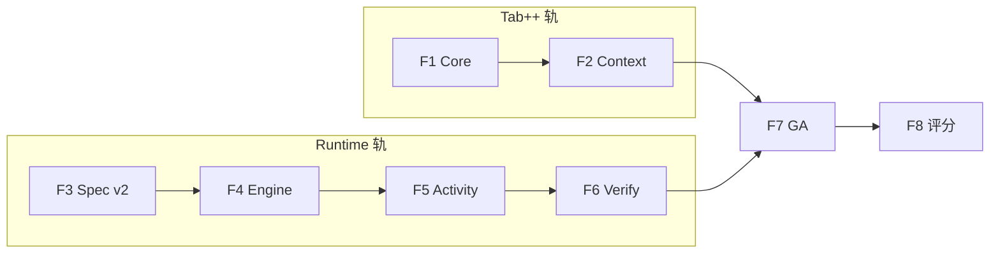

# v1.5 规划（C 轨 · 高体验 · AIDE Runtime + Tab++）

> **更新**：2026-06-05  
> **状态**：📋 规划（待 **v1.4.9** 门）  
> **战略**：[V1.5_STRATEGY_PIVOT.md](./V1.5_STRATEGY_PIVOT.md)  
> **运行体系**：[AIDE_RUNTIME.md](./AIDE_RUNTIME.md)  
> **前置**：[ROADMAP_V1.4.md](./ROADMAP_V1.4.md)（v1.4.0 ✅）· [ROADMAP_V1.4.x_PATCHES.md](./ROADMAP_V1.4.x_PATCHES.md)

---

## 1. 定位

v1.5 是 **体验世代**：不再以「填坑」为主，而是交付开发者 **一眼加分** 的两项能力，并用 **AIDE Runtime** 统一编排：

| 支柱 | 对标 | v1.5 目标 |
|------|------|-----------|
| **Tab++** | Cursor Copilot++ | 多行幽灵补全 · 周围上下文 · P95&lt;400ms · 部分接受 |
| **Spec 工程** | Kiro Specs/Hooks | hooks.yaml · 验收自动化 · Spec 驱动队列 |
| **AIDE Runtime** | 独属 | Plan/Spec/Queue/Hook/Verify/Report 六层内核 |
| **Activity Line** | Windsurf Cascade  lite | Agent/终端/Hook 实时活动条 |

**综合分目标**：**≥3.50**（v1.5 GA 复评）  
**宣传**：仍 **关闭**，直至 GA 后单独决策。

---

## 2. 子版本

| 子版本 | 主题 |
|--------|------|
| **v1.5.0** | F1–F8 大版本（本文件） |
| **v1.5.1～1.5.9**（预留） | Tab++/Runtime 抛光 patch 线 |

---

## 3. v1.5.0 能力表（F1–F8）

| 阶段 | 主题 | 竞品收益 | 状态 |
|------|------|----------|:----:|
| **F1** | Tab++ Core：多行 ghost · FIM fill-in-middle | vs Cursor Tab++ | ⬜ |
| **F2** | Tab++ Context：打开文件 + 最近编辑 + Spec task 注入 | vs Copilot 上下文 | ⬜ |
| **F3** | Spec Artifacts v2：`hooks.yaml` · schema · 设置浏览 | vs Kiro Spec | ⬜ |
| **F4** | AIDE Runtime Engine：orchestrator · hookRunner | 独属运行体系 | ⬜ |
| **F5** | Activity Line：Agent/Hook/队列事件 UI | vs Cascade 感知 | ⬜ |
| **F6** | Verify 闭环：acceptanceRunner · 失败回流队列 | vs Kiro 验收 | ⬜ |
| **F7** | 平台 GA：v15Features · E2E · 文档 | 门禁 | ⬜ |
| **F8** | 竞品复评 · smoke 制度化 | ≥3.50 | ⬜ |



**建议并行**：F1 与 F3 可并行；**F4 依赖 F3**；F5 依赖 F4；F2 可与 F4 穿插。

---

## 4. 各阶段摘要

### F1 — Tab++ Core

- Monaco 多行 `inlineCompletions` ghost 渲染
- FIM `prefix/middle/suffix` 三段请求
- `VITE_TAB_PLUS_PLUS=true` 特性开关
- 指标：P95 &lt;400ms（生产 env）；样本 ring buffer 延续 v1.4 F1
- 文档：`V1.5_F1_TAB_PLUS_PLUS.md`

### F2 — Tab++ Context

- 上下文窗：当前文件 ±N 行 + 同目录相关文件头
- Runtime 只读快照：当前 Spec `tasks.md` 活跃 task 一行注入
- 「部分接受」：Ctrl+→ 接受一词；Tab 跳下一 suggestion

### F3 — Spec Artifacts v2

- `hooks.yaml` JSON Schema + 设置中心 Spec 卡片
- Spec 目录浏览增强（未完成数 · 最近 Hook 日志）
- ADR：`ADR_V1.5_AIDE_RUNTIME.md`

### F4 — AIDE Runtime Engine

- `runtimeOrchestrator` 统一入队（Plan/Spec/Adhoc）
- `hookRunner`：`queue.before|after` · `apply.after`
- `runtime-state.json` 读写

### F5 — Activity Line

- `ActivityLine` 组件：折叠条 + 事件列表
- 订阅：队列进度 · Agent 文件写入 · Hook 状态
- 桌面：终端 tail 可选注入（诚实标注浏览器限制）

### F6 — Verify 闭环

- `acceptanceRunner`：解析 acceptance.md checkbox / shell 块
- `verify.fail` → enqueue 修复 / 暂停队列
- 队列完成自动报告（默认开）

### F7 — 平台 GA

- `v15Features.ts` + `SettingsV15FeaturesCard`
- E2E：`e2e/aide-runtime.spec.ts` · `e2e/tab-plus-plus.spec.ts`
- `RELEASE_NOTES_v1.5.0.md` · `V1.5_GA_EXECUTION.md` · `V1.5_ENV.md`

### F8 — 评分与收官

- `COMPETITOR_SCORE_V1.5.md`
- 更新 `IDE_GAP_CHECKLIST` 目标达成列
- `V1.6_KICKOFF.md` 起草（SSH/支付生产/云 Agent 候选）

---

## 5. 启动 v1.5.0 条件（v1.4.9 门）

- [ ] v1.4.1～v1.4.9 全部 tag
- [ ] smoke 连续 **2 周** 5/5（自 1.4.9 部署日起算）
- [ ] `AIDE_RUNTIME.md` RFC 评审（1.4.4）
- [ ] Tab++ spike POC 通过（1.4.3 · 多行 ghost 可见）
- [ ] `hooksSchema` 单测绿（1.4.5）
- [ ] Activity Line RFC（1.4.8）+ `V1.5_KICKOFF` 评审签字
- [ ] CI 全绿

详见 [V1.4.9_KICKOFF.md](./V1.4.9_KICKOFF.md)。

---

## 6. 发版门禁（v1.5.0 GA）

```bash
npm run test:local
npm run test:e2e:local
npm run test:e2e:stack
npm run test:e2e:collab
npm run smoke:production -- https://ai-ide-flame.vercel.app
```

| 基线 | v1.5.0 目标 |
|------|:-----------:|
| `test:local` | ≥712 绿（只增不减） |
| E2E UI | ≥48（+Runtime +Tab++） |
| E2E 合计 | ≥49 |
| 综合分 | **≥3.50** |

---

## 7. v1.5 搁置（v1.6+）

| 能力 | 说明 |
|------|------|
| SSH 远程 | 企业场景 |
| SSO / 团队 | B 端 |
| VSIX | 仍不追 |
| 云后台 Agent 30min | v1.6 队列深化 |
| 支付生产化 | 与宣传决策绑定，非 v1.5 主线 |
| 全量 LSP | 维持 TS/Python 深化 |

---

## 8. 文档索引

| 文档 | 用途 |
|------|------|
| [V1.5_KICKOFF.md](./V1.5_KICKOFF.md) | F1–F8 执行清单 |
| [AIDE_RUNTIME.md](./AIDE_RUNTIME.md) | 运行体系 RFC |
| [V1.5_STRATEGY_PIVOT.md](./V1.5_STRATEGY_PIVOT.md) | 战略说明 |
| [NEXT_EXECUTION.md](./NEXT_EXECUTION.md) | 工程入口 |
