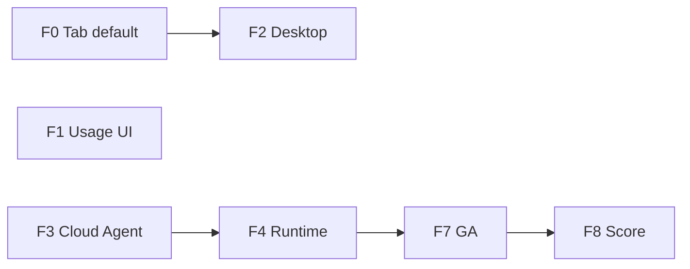

# v1.6 规划（抛光 · 支付生产 · 云 Agent）

> **更新**：2026-06-05  
> **状态**：📋 **起草**（v1.5.9 门后评审定稿）  
> **前置**：[ROADMAP_V1.5.x_PATCHES.md](./ROADMAP_V1.5.x_PATCHES.md)（v1.5.x 抛光线）  
> **Kickoff**：[V1.6_KICKOFF.md](./V1.6_KICKOFF.md)

---

## 1. 定位

v1.6 是 **能力世代**：在 v1.5.x 完成部署与支付生产后，推进 **Tab 默认生产 · 云 Agent MVP · 桌面壳深化**，综合分目标 **≥3.55**（冲刺 **3.6** 与 Cursor 差距 **&lt;0.05**）。

| 支柱 | v1.5.9 收官 | v1.6 目标 |
|------|:-----------:|:---------:|
| Tab++ | prod 可开 · 指标可见 | **默认开** · P95 绿 · 部分接受 polish |
| 平台 AI | 网关 + 支付生产 | 用量仪表盘 · 超额提示 · Team 档 |
| Runtime | F4–F6 首版 | agent hook 排水 · 队列与 IndexedDB 对齐 |
| 云 Agent | 策略卡 | **Cron MVP** · 工作区回写 |
| 桌面 | Electron 壳 | **本机终端** · runCommand 诚实路径 |
| 宣传 | 1.5.9 可选软上市 | **v1.6 GA 后 marketed 上市候选** |

---

## 2. 子版本

| 子版本 | 主题 |
|--------|------|
| **v1.6.0** | F0–F8 大版本（本文件） |
| **v1.6.1～1.6.9**（预留） | 云 Agent · 协作 RC patch |

---

## 3. v1.6.0 能力表（F0–F8）

| 阶段 | 主题 | 竞品收益 | 状态 |
|------|------|----------|:----:|
| **F0** | Tab++ 生产默认 + 延迟/ghost 抛光 | vs Cursor Tab++ | ⬜ |
| **F1** | 平台用量仪表盘 · Team 配额 UI | vs Cursor 订阅 | ⬜ |
| **F2** | Electron 终端 + 桌面 Runtime 诚实执行 | vs 本机 IDE | ⬜ |
| **F3** | 云后台 Agent MVP（Cron · 回写） | vs Cloud Agent | ⬜ |
| **F4** | Runtime 深化（agent hook · 队列持久化） | vs Kiro | ⬜ |
| **F5** | 协作 Beta → RC（权限 · 冲突） | vs 实时协作 | ⬜ |
| **F6** | SSH / SSO ADR（不承诺 GA 实现） | 企业 | ⬜ |
| **F7** | v1.6 平台 GA · E2E · 文档 | 门禁 | ⬜ |
| **F8** | 竞品复评 · v1.7 门 | ≥3.55 | ⬜ |



**建议并行**：F0 与 F1 并列 W1；F2 依赖桌面壳；F3 可与 F4 穿插。

---

## 4. 各阶段摘要

### F0 — Tab++ 生产默认

- Vercel / 生产 build **默认** `VITE_TAB_PLUS_PLUS=1`
- P95 实测回归 · debounce A/B · ghost 行数钳制
- 设置页：生产 vs POC 徽章合并为单一「Tab++ 已启用」

### F1 — 平台运维与 Team

- 登录用户用量/成本只读卡（扩 v1.2.3 F4）
- Team 档加权配额 UI · 成员邀请（P1 骨架）

### F2 — 桌面壳深化

- Electron **本机终端** 或 PTY 诚实标注
- Runtime `runCommand` / acceptance shell **桌面优先**
- 自动恢复项目 + Spec 目录 watcher（可选）

### F3 — 云后台 Agent MVP

- `npm run jobs:process` 生产 Cron
- Pro 门禁 · 结果回写工作区 · Chat 通知
- 不做 30min 全自动无人值守（v1.7+）

### F4 — Runtime 深化

- `run: agent` hook 排水至 Chat 队列
- 队列状态与 `runtime-state.json` 双写一致
- verify.fail → enqueue 修复 **E2E 全路径**

### F5 — 协作 RC 候选

- Viewer/Editor 权限矩阵文档化
- 双机 smoke 纳入周更

### F6 — 企业 ADR

- SSH 远程开发 · SSO 仅 ADR + spike 边界
- **不**在 v1.6.0 承诺 GA

### F7 — 平台 GA

- `v16Features.ts` · `SettingsV16FeaturesCard`
- `V1.6_ENV.md` · `RELEASE_NOTES_v1.6.0.md`
- E2E 基线 **70+**

### F8 — 评分与收官

- `COMPETITOR_SCORE_V1.6.md`（目标 **≥3.55**）
- `V1.7_KICKOFF.md` 起草

---

## 5. 启动 v1.6.0 条件

- [ ] v1.5.9 tag + deploy
- [ ] smoke 连续 **2 周** 5/5（自 v1.5.0/1.5.1 部署日起算可重叠）
- [ ] Stripe + 支付宝 **生产** 至少各 1 笔成功订阅 smoke
- [ ] `ROADMAP_V1.6.md` + `V1.6_KICKOFF` 评审签字

---

## 6. 发版门禁（v1.6.0 GA）

```bash
npm run test:local
npm run test:e2e:local
npm run test:e2e:stack
npm run test:e2e:collab
npm run smoke:production -- https://ai-ide-flame.vercel.app
```

| 基线 | v1.6.0 目标 |
|------|:-----------:|
| `test:unit` | ≥820 |
| E2E 合计 | ≥70 |
| 综合分 | **≥3.55** |

---

## 7. v1.6 搁置（v1.7+）

| 能力 | 说明 |
|------|------|
| VSIX | 仍不追 |
| 全语言 LSP | TS/Python 维持 |
| Kiro Hook 市场 | 四类 hook 已够 |
| 30min 无人 Cloud Agent | v1.7 |

---

## 8. 文档索引

- [COMPETITOR_SCORE_V1.5.md](./COMPETITOR_SCORE_V1.5.md)
- [IDE_GAP_CHECKLIST.md](./IDE_GAP_CHECKLIST.md)
- [NEXT_EXECUTION.md](./NEXT_EXECUTION.md)
