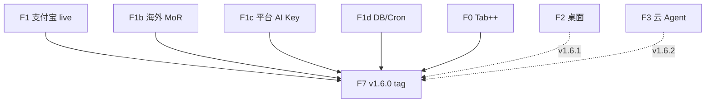

# v1.6 规划 — 上市前最后一个大版本

> **更新**：2026-06-07  
> **状态**：🚀 **执行中**（v1.5.9 已收官 · Paddle 拒审 · 进入 GA 冲刺）  
> **执行清单**：[V1.6_GA_EXECUTION.md](./V1.6_GA_EXECUTION.md)  
> **支付决策**：[V1.6_PAYMENT_DECISION.md](./V1.6_PAYMENT_DECISION.md)  
> **Kickoff**：[V1.6_KICKOFF.md](./V1.6_KICKOFF.md)

---

## 1. 定位（修订）

**v1.6 = 上市就绪 GA**，不是无限加功能的世代。

| 支柱 | v1.5.9 | **v1.6.0 GA** |
|------|:------:|:-------------:|
| 国内商业化 | 代码 + 沙箱 | **支付宝 live** ¥39/¥79 |
| 海外商业化 | Stripe 不可用 · Paddle 拒审 | **Lemon Squeezy live** 或 **Free+BYOK 兜底** |
| 平台 AI | 网关代码 | **生产 Key + 配额可信** |
| Tab++ | prod 可开 | **默认开 + P95 绿** |
| 云 Agent / 桌面 | 策略卡 | **→ v1.6.1 patch**（不挡 GA） |
| 宣传 | 关闭 | **v1.6.0 仍不大推** · v1.7 marketed 战役 |
| 综合分 | ~3.50 | **≥3.55** |

---

## 2. 子版本

| 版本 | 主题 |
|------|------|
| **v1.6.0** | 上市就绪 GA（P0：支付 · 平台 AI · Tab · 运维） |
| **v1.6.1** | 海外 MoR 补齐 **或** Electron 终端 |
| **v1.6.2** | 云 Agent Cron MVP |
| **v1.6.3+** | Runtime / 协作 patch |
| **v1.7.0** | marketed 大推 · 宣传 · 渠道 |

---

## 3. v1.6.0 能力表（F0–F8 修订）

| 阶段 | 主题 | P | 状态 |
|------|------|:-:|------|
| **F1** | 支付宝 live + 实付 smoke | P0 | ⬜ |
| **F1b** | 海外 MoR（LS/Polar）或 BYOK 兜底 ADR | P0 | ⬜ |
| **F1c** | `PLATFORM_DEEPSEEK_API_KEY` 生产 | P0 | ⬜ |
| **F1d** | DB migrate · billing cron · 订阅不静默降级 | P0 | 🔶 migrate 已跑 |
| **F0** | Tab++ 生产默认 · P95 | P0 | ⬜ |
| **F7** | v1.6.0 tag · RELEASE · E2E ≥70 | P0 | ⬜ |
| **F1e** | 用量/Team 配额 UI polish | P1 | ⬜ |
| **F2** | Electron 终端 | P1 | ⬜ |
| **F3** | 云 Agent Cron MVP | P1 | ⬜ |
| **F4** | Runtime 抛光 | P1 | ⬜ |
| **F5** | 协作 RC 文档 | P2 | ⬜ |
| **F6** | SSH/SSO ADR | P2 | ⬜ |
| **F8** | `COMPETITOR_SCORE_V1.6.md` | P0 | ⬜ |

---

## 4. 启动 v1.6.0 冲刺条件

- [x] v1.5.9 代码线收官
- [x] Paddle 法律页 + 代码（商户拒审已记录）
- [x] Neon paddle 列 migrate
- [ ] 支付宝 live 实付 smoke
- [ ] 海外 MoR 决策落地（A 或 B）
- [ ] smoke 连续 2 周 5/5（可与其他 P0 并行）

---

## 5. v1.6.0 GA 门禁

见 [V1.6_GA_EXECUTION.md](./V1.6_GA_EXECUTION.md) §7。

| 基线 | 目标 |
|------|:----:|
| `test:unit` | ≥820 |
| E2E | ≥70 |
| smoke:production | 5/5 |
| 综合分 | **≥3.55** |

---

## 6. 搁置（v1.7+）

VSIX · 全语言 LSP · Paddle live · 30min 无人 Cloud Agent · SSH/SSO 实现 · 大规模宣传

---

## 7. 文档索引

- [V1.6_GA_EXECUTION.md](./V1.6_GA_EXECUTION.md) — **主执行**
- [V1.6_PAYMENT_DECISION.md](./V1.6_PAYMENT_DECISION.md)
- [CN_PAYMENT_SETUP.md](./CN_PAYMENT_SETUP.md)
- [COMPETITOR_SCORE_V1.5.md](./COMPETITOR_SCORE_V1.5.md)
- [NEXT_EXECUTION.md](./NEXT_EXECUTION.md)
