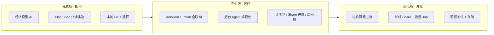

# AIDE 订阅价值路线图

> **更新**：2026-06-05  
> **背景**：Phase 1–8 体验与联动已落地，但 **付费档位感知弱** — 用户看到的差异主要是「配额数字 + 模型档」，与 AIDE「多功能一体化闭环」的产品叙事不匹配，会压低转化。  
> **原则**：不烧钱无限 Token；订阅卖 **工程闭环能力 + 协作外延 + 舒适留存**，AI 配额是成本护栏而非唯一卖点。  
> **关联**：[AIDE_MASTER_PLAN.md](./AIDE_MASTER_PLAN.md) · [plans.ts](../lib/billing/plans.ts) · [backgroundJobEntitlement.ts](../lib/api/backgroundJobEntitlement.ts)

---

## 一、现状诊断（2026-06-20 同步）

> 以下与 `lib/billing/entitlements.ts`、服务端 handlers 一致。早期「文案写了、代码未差异化」问题已在 **S1–S6** 解决。

### 已生效的付费差异

| 能力 | 免费 | 专业 Pro | 团队 Team |
|------|:----:|:--------:|:---------:|
| 平台 AI 模型档 | 仅 economy | 全档 | 全档 |
| 每日加权配额 | 200 | 2000 | 不限 |
| 云工作区 | 3 | 20 | 不限 |
| 云存储 | 5 GB | 30 GB | 100 GB |
| Share 条数 / TTL | 5 / 7天 | 30 / 90天 | 100 / 365天 |
| 后台 Agent | 2/日 · 并发1 | 100/日 · 并发5 · 批量≤5 | 300/日 · 并发10 · 批量≤20 |
| Autopilot | 3/日 | 不限 | 不限 |
| Intent 全联动 / 证明包 HTML | 否 | 是 | 是 |
| Share 进度关注 | 否 | 否 | **是**（Team 专属，邮件备案后） |
| 协作主持 | 否 | ≤4人 | ≤10人 |
| Session Resume | 24h | 7d | 7d |

实现：`entitlements.ts` · `workspaces/index.ts` · `workspaceStorageEntitlement.ts` · `backgroundJobEntitlement.ts` · `autopilotUsage.ts` · `planFeatureGate.ts`

### 仍待加强

| 项 | 说明 |
|----|------|
| 海外 checkout | `overseasCheckout.ts` 延后，Stripe/Paddle 未开 |
| 协作 OT | Beta，不宜作 GA 主卖点 |
| Runtime 默认 | 生产构建 `VITE_AIDE_RUNTIME` 默认 ON；需确保 `.env.production` 含 `VITE_AIDE_RUNTIME_UI` |
| 部分 Tier C API | 仍以客户端 `planFeatureGate` 为主，服务端统一 `assertEntitlementFeature` 可继续补 |
| Share 进度邮件 | 本地 watch 已 Team 门控；邮件推送备案后 |

### 结论（更新）

用户付 ¥39 买到 **闭环 OS**（Autopilot · 证明包 · Intent 联动）；付 ¥79 买到 **交付外延**（长链 Share · 批量 Agent · 进度关注 · 更大协作）。转化触点见 Activity Line、Settings 权益卡、Welcome 对比表。

---

## 二、订阅价值主张（重新包装）

### 一句话

> **免费版**：把 AIDE 当「带 Spec 的智能编辑器」日常用。  
> **专业版**：把 AIDE 当 **个人工程闭环 OS** — Autopilot、证明包、长时后台 Agent、完整 Intent 联动。  
> **团队版**：把 AIDE 当 **可协作的交付空间** — 房间、长链 Share、批量队列、（后续）进度订阅。

### 四大价值柱（对应已有代码）

| 价值柱 | 用户语言 | 成本可控手段 |
|--------|----------|--------------|
| **闭环执行** | 「Spec 验收 → 证明包 → 分享，不用换工具」 | Autopilot/队列限次，Agent 走加权配额 |
| **长时算力** | 「关页继续跑 Agent，回来一键合并」 | 并发 + 日次上限（已有） |
| **协作交付** | 「只读进度页 + 房间 Review，不用录屏」 | Share TTL/条数、房间人数 |
| **舒适留存** | 「换项目布局还在、今天从哪接着干」 | 纯本地/轻存储，几乎零边际成本 |

---

## 三、目标档位矩阵（建议）

价格维持 **Pro ¥39 / Team ¥79**（`plans.ts` 已有 `priceCny`）。

### 3.1 AI 与算力

| 项 | 免费 | Pro | Team |
|----|:----:|:---:|:----:|
| 平台模型 | economy | 全档 | 全档 |
| 日配额（加权） | 200 | 2000 | 不限 |
| Tab++ 补全 | 计入配额；debounce 偏保守 | 计入配额；可配 premium 模型 | 同 Pro |
| 后台 Agent 日次 | 2 | 100 | 300 |
| 后台 Agent 并发 | 1 | 5 | 10 |
| Plan 批量入队 Job | — | 单次 ≤5 | 单次 ≤20 |

### 3.2 工程闭环（Intent / Spec）

| 项 | 免费 | Pro | Team |
|----|:----:|:---:|:----:|
| Plan · Spec · Queue 基础 | ✅ | ✅ | ✅ |
| **Autopilot Lite** | 3 次/日 或 手动 only | ✅ 不限 | ✅ |
| Intent replay / drift / graph v2 | 只读预览 | ✅ 完整 | ✅ |
| 证明包 HTML 导出 | Markdown only | ✅ MD+HTML | ✅ |
| Git↔Spec banner + 审查模式 | ✅ | ✅ | ✅ |
| 周回顾 | 查看 | 复制/导出 Markdown | + 定时邮件（备案后） |

### 3.3 云与协作

| 项 | 免费 | Pro | Team |
|----|:----:|:---:|:----:|
| 云工作区 | **3 个** | 20 个 | 不限 |
| 云存储（计量后） | 5 GB | 30 GB | 100 GB |
| 云 Share 条数 | 5 | 30 | 100 |
| Share 有效期 | 7 天 | 90 天 | 365 天 |
| Share 只读进度页 | 查看 | 查看 + 本地备注 | + 关注/邮件（后续） |
| intent-share 导入 | — | ✅ | ✅ |
| 协作房间 | 仅加入 | 主持 · ≤4 人 | 主持 · ≤10 人 |

### 3.4 舒适层

| 项 | 免费 | Pro | Team |
|----|:----:|:---:|:----:|
| Session Resume | 最近一次 | 完整历史 | 同 Pro |
| 工作模式 + 项目布局记忆 | 当前项目 | 多项目 | 同 Pro |
| 命令面板联动组 | 基础 | 全量 | 全量 |

> **BYOK 用户**：仍可为 **闭环 / 协作 / 舒适** 付费 — AI 走自有 Key，订阅不解锁模型，但解锁 Autopilot、Share TTL、房间主持等 **非 Token 能力**（需在 UI 明确标注）。

---

## 四、升级触点设计（转化而不骚扰）

在 **用户已感受到价值、且遇到硬限制** 时提示升级 — 联动 Phase 5 事件总线。

| 触点 | 触发 | 文案方向 | 跳转 |
|------|------|----------|------|
| Autopilot 日限 | 第 4 次点击 | 「今日 Autopilot 已用完 — Pro 无限推进 Spec 队列」 | 订阅 Modal · Pro |
| 证明包 HTML | 点击导出 HTML | 「Pro 可导出可分享 HTML 证明包」 | Pro |
| 云 Share 7 天 | 创建 Share | 展示 TTL；Pro 90 天 | Pro |
| 后台 Agent 上限 | `api.job.dailyLimitUpgrade` | 已有 i18n | Pro |
| 模型档 403 | `api.usage.modelTierRestricted` | 已有 | Pro |
| 协作主持 | 创建房间 | 「免费版可加入；主持需 Pro」 | Pro/Team |
| 工作区第 4 个 | `api.workspace.limitReached` | 已有 API 文案 | Pro |
| 今日焦点 + 联动条 | Spec 全验收 | 「保存证明包并分享进度 — Pro 长链 Share」 | Share + 订阅 |

**不做**：启动弹窗、每次 Chat 弹升级、全屏遮罩。

---

## 五、实现路线（Phase S1–S5）

### Phase S1 — 权益内核（约 3–4 天）⭐ 先做

**交付**

- 新建 `lib/billing/entitlements.ts`：`PlanEntitlements` 类型 + `getEntitlements(planName)` + `assertEntitlement(userId, feature)`
- 替换散落 magic number：`backgroundJobEntitlement` · `projectSharesService` · workspace limit 统一读 entitlements
- 前端 `subscriptionService.canUseFeature(feature)` 接 entitlements 镜像
- 更新 `BILLING_PLANS.features` + `SubscriptionModal` + `translations` **按上表重写卖点**
- 设置页增加「当前计划权益」摘要卡片（读 entitlements）

**验收**：单测覆盖三档矩阵；订阅 Modal 展示的条目与代码一致。

### Phase S2 — 云资源硬门（约 3 天）

**交付**

- 免费 `workspaces: 3`（改 `plans.ts` limits，已有 `handlers/workspaces` 拦截）
- Share：`SHARE_TTL_MS` / `MAX_SHARES_PER_USER` 按 plan（改 `projectSharesService` + create handler）
- 存储：工作区 payload 累计字节 → 软计量 + 超限时 `api.storage.limitReached`（可先按 workspace JSON 大小估算）

**验收**：e2e 或 API 测试：free 第 4 工作区 429；Share TTL 响应含 `expiresAt` 差异。

### Phase S3 — 闭环功能门（约 4 天）

**交付**

- `isTierCEnabled(flag)` 改为 `isEntitlementEnabled(flag, plan)` 或双层：env 总开关 + plan 子集
- Autopilot 日限：free 3/日（client + server 双检，server 记 usage type `autopilot_run`）
- 证明包 HTML：free 仅 MD（`proofOfDoneReportService` 或导出按钮门控）
- intent-share 导入：Pro+
- 周回顾导出：Pro+（`WeeklyRecapModal` 按钮）

**验收**：免费账号 Autopilot 第 4 次出现升级 CTA；Pro 可 HTML 导出。

### Phase S4 — 团队差异化（约 3 天）

**交付**

- 协作房间 API：`createCollabRoom` 检查 plan；Team 提高 `maxParticipants`
- 后台 Agent：Team 并发 10、日次 300；batch 上限 20
- Share 100 条 / 365 天仅 Team
- `enterprise` 显示名统一为「团队版」（与 i18n 一致）

**验收**：Team 与 Pro 在协作人数、Share 上限可测差异。

### Phase S5 — 感知与转化（约 2 天）

**交付**

- 用量 Dashboard 增加「解锁项」：`usageDashboard` 返回 `entitlements` + `nearLimits`
- 联动 `aideLinkBus`：`quota-exceeded` · `entitlement-blocked` 事件 → Activity Line 一行提示
- Welcome 非 welfare 模式下展示 **三档对比表**（简版）
- 更新 `public/legal/payment.html` 权益描述

### Phase S6 — 舒适层收尾（约 1–2 天）

**交付**

- 云工作区 payload 累计字节 → `api.storage.limitReached`（5 / 30 / 100 GB）
- Session Resume：免费 24h · Pro/Team 7d
- 命令面板「联动」组：免费仅「继续上次工作」；Pro+ 全量

**验收**：超大云同步返回 413 + 升级文案；免费 25h 前快照不显示 Resume。

---

## 六、成本护栏（与 Master Plan 一致）

1. **永不** 免费全档模型或无限 Agent — economy + 硬 cap 保底线。  
2. **Pro 2000 配额** 够用但不宽裕；重度用户自然升 Team。  
3. **舒适功能**（Resume、布局）可给免费 **基础版**，Pro 给 **完整版** — 边际成本≈0，换感知价值。  
4. **Team 配额 -1** 保留，但 Agent 仍保留日次/并发（防滥用与 API burn）。  
5. 所有门控 **服务端为准**，前端仅 UX 预检。

---

## 七、指标（上线后 4 周观察）

| 指标 | 目标 |
|------|------|
| 订阅 Modal 打开 → 支付启动 | ≥ 8%（内测基线后定） |
| 触点升级（Autopilot/Agent/模型）→ 支付 | 各触点 ≥ 5% |
| 免费 D7 留存 | 不下降（避免过度限制） |
| Pro 用户周 Autopilot 使用 | ≥ 40% Pro 用户 |
| 退款/降级原因（客服/问卷） | 「没感觉到差异」< 20% |

---

## 八、与总规划衔接

| 原「下一 Sprint」 | 调整 |
|-------------------|------|
| Share 邮件订阅 | 降为 Team 权益，S4 后 + 备案 |
| 联动 → Activity Line | 并入 **S5** |
| 支付宝 live / 备案 | 仍 Phase 8 运维，不阻塞 S1–S3 |
| **新增优先** | **S1 权益内核 + 重写订阅文案** |

建议在 [AIDE_MASTER_PLAN.md](./AIDE_MASTER_PLAN.md) 增加大项 **G — 订阅价值 Substance**，与体验层 B、联动 C 并列。

---

## 九、S1 任务清单（可直接开干）

- [x] `lib/billing/entitlements.ts` + test
- [x] `plans.ts` limits/features 与矩阵对齐
- [x] 重构 `backgroundJobEntitlement.ts` 读 entitlements
- [x] `SubscriptionModal` / `translations` 卖点重写（闭环 · 协作 · 舒适）
- [x] `SettingsCenter` 权益摘要卡（`PlanEntitlementsCard`）
- [x] `subscriptionService.canUseFeature` 接 feature enum
- [x] 文档：`payment.html` 同步（S5）

**S1–S5 已接线**：Share TTL/条数 · 工作区 3/20/∞ · 批量 Job 门控 · Autopilot 日限 · 证明包 HTML · intent-share · 周回顾 · Intent 联动 · 协作主持 · Dashboard 解锁项 · Welcome 对比表  
**S6 已接线**：云存储计量 + 413 升级触点 · Session Resume 24h/7d · 命令面板联动组 · AI 配额 Activity Line
