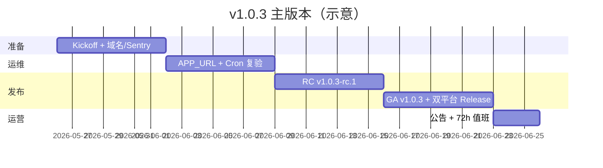

# v1.0.3 主版本 — 大规划（Master Plan）

> **状态**：**正式 Kickoff**（2026-05-26）  
> **前置**： [1.0.2.x](./ROADMAP_V1.0.2.x.md) **1.0.2.1～1.0.2.7** 已全部交付  
> **版本策略**：[VERSIONING.md](./VERSIONING.md)  
> **Kickoff 清单**：[V1.0.3_KICKOFF.md](./V1.0.3_KICKOFF.md)

---

## 1. 一句话定位

**1.0.3** = 在 **1.0.2 GA + 全套附属** 之上的 **对外主版本升级**：

- 从「1.0.2 公测 GA + 附属补丁」→ **「1.0.3 稳定版」** 品牌叙事  
- 竞品综合分 **≥ 2.75**（已在本仓库 1.0.2.7 复评中达成，1.0.3 做 **对外发布 + 运营封板**）  
- 双平台桌面（Win + macOS）+ 自定义域名 + 运维 SOP **常态化**  
- 为 **v1.1**（后台 Agent、协作 M1、网关）清债，**不**在本版做 Cursor 全量替代

---

## 2. 成功指标（Must / Should）

| 类型 | 指标 | 验收 |
|------|------|------|
| **Must** | GitHub Release **v1.0.3** | Web deploy + Win + Mac 资产 |
| **Must** | `go-live:preflight` 全绿 | 本地 + 生产 smoke |
| **Must** | 竞品文档 **≥ 2.75** 与代码一致 | [COMPETITOR_COMPARISON_V1.0.2.md](./COMPETITOR_COMPARISON_V1.0.2.md) |
| **Must** | 自定义域名 + `APP_URL` 生产验证 | [CUSTOM_DOMAIN.md](./CUSTOM_DOMAIN.md) |
| **Should** | Sentry release `ai-ide@1.0.3` | `VITE_SENTRY_DSN` |
| **Should** | 72h 运维 SOP 写入 GA 文档 | [GA_POST_LAUNCH_72H.md](./GA_POST_LAUNCH_72H.md) |
| **Should** | 对外公告（掘金/CSDN/GitHub Discussions） | 可引用 [publish/](./publish/) |
| **Could** | macOS 代码签名（Apple Developer） | 非 blocker |

---

## 3. 工作流（六大流）

### WS-A — 产品叙事与发布矩阵

| 任务 | 说明 |
|------|------|
| A-1 | README / 欢迎页：「**1.0.3 稳定版**」 |
| A-2 | CHANGELOG `[1.0.3]` 汇总 1.0.2.x 能力 |
| A-3 | GitHub Release Notes + Discussions 公告 |
| A-4 | [publish/CSDN_POST.md](./publish/CSDN_POST.md) 等升版 |

### WS-B — 运维与信任

| 任务 | 说明 |
|------|------|
| B-1 | 生产 `APP_URL` = 自定义域（或确认 vercel.app 为主） |
| B-2 | Cron 双 secret + `billing:verify-cron` 常态化 |
| B-3 | Sentry DSN + release 对齐 `1.0.3` |
| B-4 | [BROWSER_LIMITATIONS.md](./BROWSER_LIMITATIONS.md) / 法务页主体信息 |
| B-5 | macOS 签名决策记录（签 or 文档说明 unsigned） |

### WS-C — 桌面双平台

| 任务 | 说明 |
|------|------|
| C-1 | Release **v1.0.3** tag → Win + Mac 同 tag |
| C-2 | `electron-updater` 跨平台 smoke |
| C-3 | 下载页 / README 双平台说明 |

### WS-D — 竞品与评分

| 任务 | 说明 |
|------|------|
| D-1 | 1.0.2.7 复评 **2.75** 已写入对比文档 |
| D-2 | 1.0.3 发布时再跑一轮 **live 抽测**（Tab / Agent / @ / 支付） |
| D-3 | 更新对外话术 §11（仍不说「替代 Cursor」） |

### WS-E — 商业化与合规

| 任务 | 说明 |
|------|------|
| E-1 | 支付宝 Path B 生产复验 |
| E-2 | 微信 live **决策记录**（接 or 文档「仅支付宝」） |
| E-3 | 订阅页 / 发票主体与 [V1.0.2.1_RELEASE.md](./V1.0.2.1_RELEASE.md) 对齐 |

### WS-F — 工程门禁（不扩 scope）

| 任务 | 说明 |
|------|------|
| F-1 | `test:local` + CI 全绿 |
| F-2 | E2E UI 发版前抽跑 |
| F-3 | 技术债清单进 v1.1 backlog（LSP、Background Agent 等 **不做**） |

---

## 4. 里程碑时间线（建议 4～6 周）



| 周 | 交付 |
|----|------|
| W0 | Kickoff（本文 + [V1.0.3_KICKOFF.md](./V1.0.3_KICKOFF.md)） |
| W1 | 域名 / Sentry / 文档主体 |
| W2 | RC 构建、`go-live:preflight` |
| W3 | **v1.0.3** tag、Release、公告 |
| W4 | 72h 观测、竞品 live 复测记录 |

---

## 5. 明确非目标（留 v1.1+）

| 非目标 | 原因 |
|--------|------|
| Cursor Tab++ / 全感知 Cascade | 需 LSP + 大模型产品化 |
| Background / Cloud Agent | 需队列 + 沙箱 + 计费 |
| Kiro Hooks / Spec 引擎 | 1.0.2.6 已做 **轻量 tasks.md** |
| VSIX 插件市场 | 架构不兼容 |
| 全语言 DAP 调试 | 独立大项 |

---

## 6. v1.1 前瞻（1.0.3 完成后）

| 方向 | 草案 |
|------|------|
| 后台 Agent 队列 | 30min 无人值守改仓 |
| 协作 M1 | 信令稳定 + 权限 |
| AI 网关 | 平台 Key 可选 |
| i18n Phase 2 | 日文等 |

见 [PLAN_STRATEGY_2026_Q3.md](./PLAN_STRATEGY_2026_Q3.md)（若存在）或新建 v1.1 RFC。

---

## 7. 验收命令

```powershell
npm run go-live:preflight
npm run test:local
# 可选
npm run test:e2e -- --project=ui
```

**Release**：

```powershell
git tag v1.0.3
git push origin v1.0.3
# Vercel 自动 Web；desktop-release Win+Mac
```

---

## 8. 文档索引

| 文档 | 用途 |
|------|------|
| [ROADMAP_V1.0.3.md](./ROADMAP_V1.0.3.md) | 精简路线图 |
| [V1.0.3_KICKOFF.md](./V1.0.3_KICKOFF.md) | 执行 checklist |
| [V1.0.2.7_RELEASE.md](./V1.0.2.7_RELEASE.md) | 附属收官 |
| [COMPETITOR_COMPARISON_V1.0.2.md](./COMPETITOR_COMPARISON_V1.0.2.md) | 2.75 评分 |
| [GO_LIVE_NOW.md](./GO_LIVE_NOW.md) | 上线清单 |
