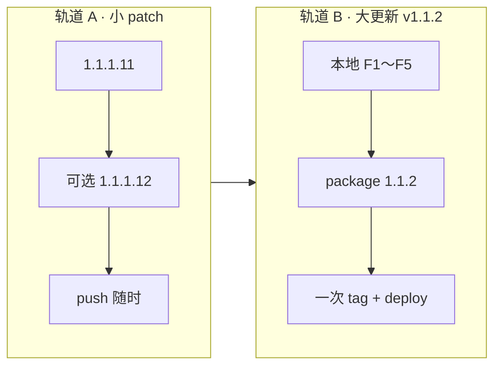

# v1.1.2 主规划 — 后台 Agent 大更新

> **状态**：**F5 完成 · GA 就绪**（待 push / tag / deploy）  
> **类型**：**大更新**（同 v1.1.1 计划系统 GA；**非** 1.1.1.10 级小 patch）  
> **GA 清单**：[V1.1.2_GA_EXECUTION.md](./V1.1.2_GA_EXECUTION.md)（DoD 占位）  
> **世代总表**：[ROADMAP_V1.1.x.md](./ROADMAP_V1.1.x.md) · **战略**：[ROADMAP_V1.1.md](./ROADMAP_V1.1.md)

---

## 0. 双轨发版模型（必读）

本仓库 v1.1 世代有两种 **完全不同** 的节奏，不可混用：

| 轨道 | 版本示例 | 对外 tag | push / deploy | 适用 |
|------|----------|----------|-------------|------|
| **A · 小 patch** | `1.1.1.10`、`1.1.1.11`、可选 `.12` | 可选 `v1.1.1.11` | **完成即 push** | GA 后修补、i18n、UX 抛光 |
| **B · 大更新** | **`1.1.2`** | **`v1.1.2`** | **整包就绪后一次** | 新能力世代、需完整验收 |



**规则**：

1. 开 **v1.1.2** 之前，先把 **1.1.1.11** push 干净（轨道 A 收口）。
2. **v1.1.2 研发期**：`package.json` 可保持 `1.1.1.11`，或内部递增 **不设对外 tag**；**禁止**半成品上生产。
3. **v1.1.2 对外**：仅当 [V1.1.2_GA_EXECUTION.md](./V1.1.2_GA_EXECUTION.md) DoD 全勾 → **一次** `release: v1.1.2`。
4. 本地排期用 **F1～F5 阶段**（见 §3），**不用** `1.1.2.1` 作为对外版本号。

---

## 1. v1.1.2 一句话

**关页后，服务端仍跑单条 Agent 任务；回来可见状态、取消、结果回写。**

与 v1.1.1 互补：

| | v1.1.1 计划系统 | **v1.1.2 后台 Agent** |
|--|-----------------|------------------------|
| 执行 | 浏览器 Tab + Chat | **服务端 Worker** |
| 关页 | 队列暂停（localStorage 恢复） | **继续执行** |
| 场景 | Plan → Spec → 报告 | 长 Agent 改仓 |

---

## 2. 大更新 MVP 边界（整包必含）

以下 **全部** 就绪才算 v1.1.2，缺一项则 **不算** 大更新、不对外发版：

| # | 能力 | 验收要点 |
|---|------|----------|
| M1 | 任务持久化 | Prisma `BackgroundJob`；`queued/running/succeeded/failed/cancelled` |
| M2 | REST API | 创建、查询、取消、列表（当前用户） |
| M3 | Worker | Cron/Worker 执行单任务；**硬超时 ≤30min** |
| M4 | 客户端 UI | 任务列表 + 详情轮询；与 Chat「任务队列」命名区分 |
| M5 | Chat 入口 | 「后台运行」提交当前 Agent 上下文 |
| M6 | 取消 | 用户取消 → `cancelled`；Worker 协作停止 |
| M7 | Pro 门禁 | Free 受限；与现有 quota 文案一致 |
| M8 | 结果回写 | 云工作区至少一种可见产出（文件变更或 Diff 队列） |
| M9 | 特性开关 | `VITE_BACKGROUND_AGENT`；生产默认按产品决策 |
| M10 | 文档 | README、CHANGELOG `[1.1.2]`、Quickstart/GA 清单、诚实限制 |

**明确不做（v1.1.2）**：Plan 多步队列后台化、PR 自动创建、>30min、本机 FS 无人值守写盘、协作 OT。

---

## 3. 本地研发阶段（F1～F5 · 非对外版本）

> 仅用于排期与 commit 粒度；**不对应** `package.json` 第四段对外 patch。

### F1 — 服务端基础（≈1～2 周）

- Prisma `BackgroundJob` + migrate
- `POST/GET/GET list/POST cancel` `/api/jobs`
- 集成测试；`VITE_BACKGROUND_AGENT=false`
- **出口**：API 可创建任务，status=`queued`，**尚无 Worker**

### F2 — 执行引擎（≈1～2 周）

- Cron `process-jobs` + 鉴权
- 抽取/复用 `agentRunner`；`progress` JSON
- 超时 → `failed`
- **出口**：dev 环境 dummy 任务可跑完

### F3 — 客户端闭环（≈1～2 周）

- `BackgroundJobsPanel` + 轮询
- Chat「后台运行」
- 取消链路打通
- **出口**：关 Tab 再打开，面板见终态（dev）

### F4 — 商业与回写（≈1 周）

- Pro / quota 门禁
- 云工作区 `result` 写回 + IDE 展示
- **出口**：黄金路径 §4 可演示

### F5 — GA 收口（≈3～5 天）

- `package.json` → **1.1.2**
- [V1.1.2_GA_EXECUTION.md](./V1.1.2_GA_EXECUTION.md) DoD 勾选
- `npm run test:local` + `build:deploy`
- **出口**：一次 push + `tag v1.1.2` + deploy + Release

**建议总工期**：6～10 周（单人），视 Worker/沙箱难度浮动。

---

## 4. 黄金路径（GA 手工验收 · 30min）

1. Pro 用户登录 → Chat Agent 跑一条改文件 prompt → **后台运行**
2. **关闭浏览器 Tab** → 等待 ≥2min
3. 重新打开 IDE → **后台任务**面板显示 `succeeded`
4. 打开工作区 → **可见文件变更或 Diff 队列**
5. 再提交一条 → 运行中 **取消** → 状态 `cancelled`
6. Free 用户 → 超限提交 → **429 / 升级提示**

---

## 5. 开工门槛（Go / No-Go）

**Go**（全部满足才进入 F1）：

- [ ] `v1.1.1.11` 已 push（轨道 A 收口）
- [ ] 产品确认 **P0-A**（非协作 P0-B）
- [ ] 接受 **云工作区优先**（浏览器本机盘限制见 [BROWSER_LIMITATIONS.md](./BROWSER_LIMITATIONS.md)）
- [ ] Neon migrate + rollback 方案书面确认
- [ ] 预估 Pro 配额与成本上限

**No-Go**（继续轨道 A 小 patch，不开 v1.1.2）：

- 仅想要「Plan 队列再抛光」→ 做 **1.1.1.12～.13**，不开 v1.1.2
- 无服务端排期 → 推迟 v1.1.2，不半成品上线

---

## 6. v1.1.2 之后（预览 · 仍为大更新）

| 里程碑 | 主题 | 节奏 |
|--------|------|------|
| **v1.1.3** | 协作 M1 **或** AI 网关（**二选一 P0**） | 大更新 |
| **v1.1.4** | 发布收官 + 竞品 ~2.90 | 大更新 |
| **1.1.2.x**（第四段，可选） | 后台任务通知、Plan 桥接等 | 小 patch，**在 v1.1.2 GA 之后** |

占位：[ROADMAP_V1.1.3_COLLAB.md](./ROADMAP_V1.1.3_COLLAB.md)

---

## 7. 文档索引

| 文档 | 用途 |
|------|------|
| [NEXT_EXECUTION.md](./NEXT_EXECUTION.md) | **当前**该做哪条轨道 |
| [V1.1.2_GA_EXECUTION.md](./V1.1.2_GA_EXECUTION.md) | v1.1.2 DoD |
| [V1.1_QUEUE_SCHEMA_STUB.md](./V1.1_QUEUE_SCHEMA_STUB.md) | 表结构草案 |
| [V1.1_FEATURE_FLAGS.md](./V1.1_FEATURE_FLAGS.md) | 开关 |
| [ROADMAP_V1.1.1.x.md](./ROADMAP_V1.1.1.x.md) | 计划系统小 patch 历史 |

---

## 8. 发版命令（F5 一次性）

```powershell
cd C:\Users\18663\IDE\ai-ide
npm run test:local
npm run build:deploy
npm run go-live:preflight
# 手工 §4 黄金路径

git add .
git commit -m "release: v1.1.2 background agent MVP"
git push origin main
git tag v1.1.2
git push origin v1.1.2
npx vercel --prod --yes   # 网络可达时
```
