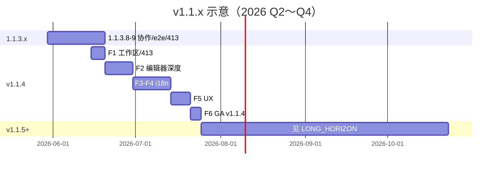

# v1.1.4 主规划 — 编辑器深度 + 体验跃迁（B 轨）

> **状态**：**GA ✅**（2026-05-30 · tag `v1.1.4` 待 push/deploy）  
> **轨道**：**B · 大更新**（F 阶段批完 → 一次 tag `v1.1.4`）  
> **前置**：**v1.1.3 GA ✅** · **1.1.3.x 冻结 ✅**  
> **Kickoff**：[V1.1.4_KICKOFF.md](./V1.1.4_KICKOFF.md)  
> **不做（本包）**：**AI 网关** → [ROADMAP_V1.2.md](./ROADMAP_V1.2.md)

---

## 0. 决策摘要

| 项 | 拍板 |
|----|------|
| **北极星** | **多维度比肩大型 IDE** — 不追求硬性功能表对打，而在 **AI 原生、协作、轻量部署、开放 BYOK** 等轴上做出差异化 |
| **P0** | **编辑器与工作区深度**（LSP 体验、大仓库、413、多根工作区基础） |
| **P1** | **i18n Phase 2 启动**（设置 / 计费 / Agent / 协作审计 + 第二语言 MVP） |
| **P2** | **全局 UX**（首登、错误态、空态、性能感知） |
| **非目标** | 网关、VSIX 商店、CRDT 逐字合并 UI、Plan 服务端队列 |

**竞品参照**：大型 IDE 作为 **能力雷达图** 输入，而非单一分数收官目标。各版本复评记录在 [ROADMAP_V1.1_LONG_HORIZON.md](./ROADMAP_V1.1_LONG_HORIZON.md)。

---

## 1. 与相邻版本边界

| 归属 **1.1.3.x**（轨道 A） | 归属 **v1.1.4**（轨道 B） | 归属 **v1.1.4.x**（轨道 A） | 归属 **v1.2** |
|-----------------------------|---------------------------|-----------------------------|---------------|
| 协作 patch、Livekit 稳定 | 编辑器深度 + UX 跃迁整包 | v1.1.4 发版后热修与小抛光 | AI 网关 P0 |
| 413 缓解（可先 patch） | i18n Phase 2 **F1～F2 启动** | i18n 漏翻、E2E 双语 | 平台 Key + 429 |

---

## 2. 本地研发阶段（F1～F6）

| 阶段 | 主题 | 估时 | 交付 |
|------|------|------|------|
| **F1** | 大仓库 / 413 / 工作区加载审计 | 4～5d | ✅ 见 [WORKSPACE_F1_AUDIT.md](./WORKSPACE_F1_AUDIT.md) |
| **F2** | 编辑器深度（LSP 补漏、格式化、符号导航抛光） | 8～10d | ✅ |
| **F3** | i18n Phase 2 审计 + 第二语言骨架（ja 优先） | 4～5d | [I18N_STATUS.md](./I18N_STATUS.md) 更新 |
| **F4** | 设置 / 订阅 / Agent / 协作 字符串 ≥95% | 8～10d | `translations.ts` + 回归 |
| **F5** | 全局 UX：Welcome、错误 Toast、空态、性能 hint | 5～7d | 首登路径、统一错误组件 |
| **F6** | E2E + GA 文档 + tag `v1.1.4` | 3～4d | RELEASE_NOTES、deploy |

**合计**：约 **32～41 人日**（1 人全职 ~6～8 周；可与 1.1.3.8 patch 交错）

内部里程碑记为 **1.1.4.1～.6**（CHANGELOG 小节）；对外 tag **`v1.1.4`**。

Patch 线详见 [ROADMAP_V1.1.4.x_PATCHES.md](./ROADMAP_V1.1.4.x_PATCHES.md)。

---

## 3. 编辑器与工作区（F1～F2）

| 项 | 说明 | 优先级 |
|----|------|:------:|
| **工作区 413** | 大 autosave 分块 / 压缩 / 跳过巨型二进制 | P0 |
| **多文件树性能** | 万级文件懒加载、搜索 debounce | P0 |
| **LSP 体验** | 补全延迟、诊断聚合、go-to-definition 稳定 | P1 |
| **格式化 / 保存** | format-on-save 与协作只读互斥清晰 | P1 |

---

## 4. i18n Phase 2（F3～F4）

| 区域 | F4 目标 |
|------|---------|
| 设置中心 | 100% `t()` |
| 订阅 / 支付 | zh-CN + en-US 完整 |
| Agent / Chat / 工具 | 补漏 |
| 协作 M1 | 纳入审计（1.1.3.6+ 已更新） |
| 第二语言 | **ja-JP MVP**（或产品另选） |

---

## 5. 协作 M1 与 v1.1.4 关系

协作 **功能** 在 v1.1.3 + 1.1.3.x 已交付；v1.1.4 **不重做** 信令，仅：

- i18n 补全协作文案  
- 大工作区 + 协作并存手测（413 与 Yjs 推送边界）  
- 可选：生产默认开启协作的产品决策 + [V1.1.3_ENV.md](./V1.1.3_ENV.md)

---

## 6. GA DoD（摘要）

| # | 项 |
|---|-----|
| 1 | `npm run test:local` + `test:e2e`（ui）全绿 |
| 2 | F1 413 与大仓库手测通过 |
| 3 | i18n Phase 2 审计表 ≥95% |
| 4 | `npm run smoke:report` 5/5 |
| 5 | `RELEASE_NOTES_v1.1.4.md` + `git tag v1.1.4` |
| 6 | 竞品雷达图复评（记录于 LONG_HORIZON，非收官分数） |

执行清单：[V1.1.4_GA_EXECUTION.md](./V1.1.4_GA_EXECUTION.md)

---

## 7. 时间线（示意，非冻结）

---

## 8. 文档索引

| 文档 | 用途 |
|------|------|
| [ROADMAP_V1.1.3.x_PATCHES.md](./ROADMAP_V1.1.3.x_PATCHES.md) | 协作 patch 线 |
| [ROADMAP_V1.1.4.x_PATCHES.md](./ROADMAP_V1.1.4.x_PATCHES.md) | v1.1.4 后 patch |
| [ROADMAP_V1.1_LONG_HORIZON.md](./ROADMAP_V1.1_LONG_HORIZON.md) | v1.1.5～1.1.9.x |
| [ROADMAP_V1.2.md](./ROADMAP_V1.2.md) | 网关 |
| [NEXT_EXECUTION.md](./NEXT_EXECUTION.md) | 当前执行入口 |
