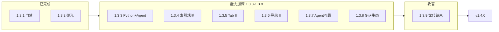

# v1.3.x 主规划 — 1.3.1 → 1.3.9

> **更新**：2026-06-05  
> **策略**：**v1.3.x 做到 1.3.9 再开 v1.4** · 零宣传 · 综合分渐进抬升  
> **轨道 A**：patch（热修 + 深度抛光）  
> **轨道 B**：**v1.4.0** 在 `v1.3.9` tag + smoke **连续 2 周绿** 后启动

---

## 1. 世代分工

| 世代 | 角色 |
|------|------|
| **v1.3.0** | 大版本能力（F1–F7） |
| **v1.3.1～1.3.2** | 门禁 + 日用抛光 ✅ |
| **v1.3.3～1.3.8** | 六轮「能力加深」— 每 patch 一个主题 |
| **v1.3.9** | **v1.3 收官** — 运维、评分、v1.4 门 |
| **v1.4** | 基础填坑冲 3.4（大版本 F1–F7） |



---

## 2. 子版本一览

| 版本 | 主题 | Kickoff | 状态 |
|------|------|---------|:----:|
| **1.3.1** | GA 收口 · smoke 1.3.x | [V1.3.1_KICKOFF.md](./V1.3.1_KICKOFF.md) | ✅ |
| **1.3.2** | Tab · 断点 · 插件样例 | [V1.3.2_KICKOFF.md](./V1.3.2_KICKOFF.md) | ✅ |
| **1.3.3** | Python import · Agent 预算 · capped | [V1.3.3_KICKOFF.md](./V1.3.3_KICKOFF.md) | ✅ |
| **1.3.4** | 索引 2.0 可观测（embedding · 遥测） | [V1.3.4_KICKOFF.md](./V1.3.4_KICKOFF.md) | ✅ |
| **1.3.5** | Tab 补全 II（指标 · 设置 · FIM 路径） | [V1.3.5_KICKOFF.md](./V1.3.5_KICKOFF.md) | ✅ |
| **1.3.6** | 导航 II（TS 精度 · Python 引用/大纲） | [V1.3.6_KICKOFF.md](./V1.3.6_KICKOFF.md) | ✅ |
| **1.3.7** | Agent/Chat 可靠（payload · MCP · apply） | [V1.3.7_KICKOFF.md](./V1.3.7_KICKOFF.md) | ✅ |
| **1.3.8** | Git 轻抛光 · 插件/MCP 硬化 | [V1.3.8_KICKOFF.md](./V1.3.8_KICKOFF.md) | ✅ |
| **1.3.9** | **收官**（smoke 周更 · 评分 · v1.4 门） | [V1.3.9_KICKOFF.md](./V1.3.9_KICKOFF.md) | ✅ |

---

## 3. 与 v1.4 的边界

**v1.3.3～1.3.8 允许**：单点加深、设置可观测、E2E/单测、文档、轻量 UI 抛光。  
**v1.3.x 全程禁止**（留给 v1.4）：

- Tab 生产级 P95 &lt;800ms 硬指标 · FIM 生产默认全开  
- 索引 2k Worker / 全量分片重建  
- Git status 矩阵 + hunk stage 完整面板  
- 桌面壳默认路径大改版  
- SSH · SSO · VSIX · 后台 Agent 生产默认可用  
- **任何宣传 / 上架**

**v1.3.9 额外交付**：`V1.4_KICKOFF.md` 起草（仅文档）。

---

## 4. 综合分爬坡（估）

| 里程碑 | 综合分 | 说明 |
|--------|:------:|------|
| v1.3.2 后 | ~3.15～3.20 | 抛光完成 |
| v1.3.5 后 | ~3.22～3.25 | Tab + 索引可观测 |
| v1.3.8 后 | ~3.26～3.30 | 导航 + Agent + Git 轻量 |
| **v1.3.9 后** | **~3.28～3.32** | 收官；**仍 &lt; 3.4** |
| v1.4 GA 目标 | ≥3.35→3.4 | 大版本填坑 |

---

## 5. 发版门禁（每 patch）

```bash
npm run test:local
npm run test:e2e:local
npm run test:e2e:stack
npm run smoke:production -- https://ai-ide-flame.vercel.app
```

| Job | 1.3.3+ 目标 |
|-----|:-----------:|
| `test:local` | ✅ |
| `test:e2e` | **42/42** UI（16 spec 文件） |
| `test:e2e:stack` | **2/2** |
| `test:e2e:collab` | **1/1**（可选 CI） |
| `smoke:production` | 5/5 |

### E2E 基线（v1.3.9 收官）

| 项目 | 数量 | 说明 |
|------|:----:|------|
| UI (`--project=ui`) | **42** | 含 TS/Python 导航 · 插件 · v13 · workbench 等 |
| Stack (`fullstack.spec.ts`) | **2** | API session + 云工作区 |
| Collab (`collab-smoke.spec.ts`) | **1** | 协作 smoke |
| **合计** | **45** | `playwright test --list` 可复验 |

---

## 6. 文档索引

| 文档 | 用途 |
|------|------|
| [ROADMAP_V1.3.x_PATCHES.md](./ROADMAP_V1.3.x_PATCHES.md) | patch 摘要表 |
| [ROADMAP_V1.3.md](./ROADMAP_V1.3.md) | v1.3 世代总览 |
| [NEXT_EXECUTION.md](./NEXT_EXECUTION.md) | 当前工程入口 |
| [V1.3.9_SMOKE_WEEKLY.md](./V1.3.9_SMOKE_WEEKLY.md) | 生产周更（1.3.9 定稿） |
| [V1.4_KICKOFF.md](./V1.4_KICKOFF.md) | v1.4 启动门（仅文档） |
| [COMPETITOR_SCORE_V1.3.9.md](./COMPETITOR_SCORE_V1.3.9.md) | 收官竞品复评 |
