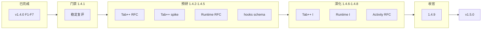

# v1.4.x 主规划 — 1.4.1 → 1.4.9

> **更新**：2026-06-05  
> **策略**：**v1.4.x 做到 1.4.9 再开 v1.5.0** · 零宣传 · 为 Tab++/AIDE Runtime 铺路  
> **Patch 详表**：[ROADMAP_V1.4.x_PATCHES.md](./ROADMAP_V1.4.x_PATCHES.md)  
> **下一世代**：[ROADMAP_V1.5.md](./ROADMAP_V1.5.md)

---

## 1. 世代分工

| 世代 | 角色 |
|------|------|
| **v1.4.0** | 大版本能力（F1–F7 生产策略填坑） |
| **v1.4.1** | 门禁 + 基线 + v1.4 竞品复评 |
| **v1.4.2～1.4.5** | Tab++/Runtime **RFC + spike + schema**（四轮预研） |
| **v1.4.6～1.4.8** | Tab++/Runtime/Activity **深化抛光**（三轮，仍非 v1.5 生产交付） |
| **v1.4.9** | **v1.4 收官** — smoke、评分、v1.5 门 |
| **v1.5.0** | Tab++ + AIDE Runtime + Activity Line（F1–F8 大版本） |



---

## 2. 子版本一览

| 版本 | 主题 | Kickoff | 状态 |
|------|------|---------|:----:|
| **1.4.1** | GA 收口 · E2E · 竞品复评 | [V1.4.1_KICKOFF.md](./V1.4.1_KICKOFF.md) | ✅ |
| **1.4.2** | Tab++ 技术 RFC | [V1.4.2_KICKOFF.md](./V1.4.2_KICKOFF.md) | ✅ |
| **1.4.3** | Tab++ spike（多行 ghost POC） | [V1.4.3_KICKOFF.md](./V1.4.3_KICKOFF.md) | ✅ |
| **1.4.4** | AIDE Runtime RFC · ADR | [V1.4.4_KICKOFF.md](./V1.4.4_KICKOFF.md) | ✅ |
| **1.4.5** | hooks.yaml schema · 设置预览 | [V1.4.5_KICKOFF.md](./V1.4.5_KICKOFF.md) | ✅ |
| **1.4.6** | Tab++ 深化 I | [V1.4.6_KICKOFF.md](./V1.4.6_KICKOFF.md) | ✅ |
| **1.4.7** | Runtime 深化 I | [V1.4.7_KICKOFF.md](./V1.4.7_KICKOFF.md) | ✅ |
| **1.4.8** | Activity Line RFC · orchestrator stub | — | ⬜ |
| **1.4.9** | **收官** · v1.5 门 | [V1.4.9_KICKOFF.md](./V1.4.9_KICKOFF.md) | ⬜ |

---

## 3. 基线（v1.4.0 / 1.4.1）

| 项 | 值 |
|----|-----|
| 单测 | **739** |
| E2E UI | **48**（含 runtime-state 预览 · 执行状态徽章） |
| E2E stack | **2** |
| E2E collab | **1** |
| E2E 合计 | **48** |

---

## 4. 与 v1.5 的边界

**v1.4.2～1.4.8 允许**：RFC · ADR · spike（特性开关）· schema 单测 · 接口 stub · 设置只读预览 · 文档 · 轻量 UX 抛光  
**v1.4.x 全程禁止**（v1.5.0 交付）：

- Tab++ 生产默认 · 多行 ghost 无开关上线
- `hookRunner` / `acceptanceRunner` 生产执行
- `runtimeOrchestrator` 真实替队列排水
- Activity Line 生产默认展示
- VSIX · SSH · SSO · 支付生产化
- **任何宣传 / 上架**

**v1.4.9 额外交付**：`V1.5_KICKOFF.md` 评审定稿（可提前起草，1.4.9 拍板）。

---

## 5. 综合分爬坡（估）

| 里程碑 | 综合分 | 说明 |
|--------|:------:|------|
| v1.4.0 | ~3.35～3.40 | F1–F7 填坑 |
| v1.4.5 后 | ~3.41 | RFC + schema 齐 |
| **v1.4.9 后** | **~3.40～3.44** | 收官；**仍 &lt; v1.5 目标 3.50** |
| v1.5 GA 目标 | **≥3.50** | Tab++ + Runtime 大版本 |

---

## 6. 发版门禁（每 patch）

```bash
npm run test:local
npm run test:e2e:local
npm run test:e2e:stack
npm run smoke:production -- https://ai-ide-flame.vercel.app
```

| Job | 1.4.1+ 目标 |
|-----|:-----------:|
| `test:local` | ✅ 712+ |
| `test:e2e` UI | **44/44** → 随 patch 只增 |
| `test:e2e:stack` | **2/2** |
| `test:e2e:collab` | **1/1** |
| smoke | **5/5** |

---

## 7. 启动 v1.5.0 条件

- [ ] v1.4.1～v1.4.9 全部 tag
- [ ] 生产 smoke **连续 2 周** 5/5（自 1.4.9 部署日起算）
- [ ] CI 全绿
- [ ] Tab++ spike（1.4.3）+ hooks schema（1.4.5）+ Runtime RFC（1.4.4）评审通过
- [ ] [V1.5_KICKOFF.md](./V1.5_KICKOFF.md) 评审签字

---

## 8. 文档索引

| 文档 | 用途 |
|------|------|
| [ROADMAP_V1.4.md](./ROADMAP_V1.4.md) | v1.4.0 大版本 |
| [V1.5_STRATEGY_PIVOT.md](./V1.5_STRATEGY_PIVOT.md) | 战略转向 |
| [AIDE_RUNTIME.md](./AIDE_RUNTIME.md) | Runtime RFC |
| [NEXT_EXECUTION.md](./NEXT_EXECUTION.md) | 当前入口 |
