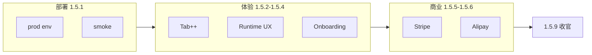

# v1.5.x 主规划 — 1.5.1 → 1.5.9

> **更新**：2026-06-05  
> **策略**：v1.5.0 交付高体验三轨 · **1.5.x 只做抛光与生产化** · 做到 **1.5.9 再开 v1.6.0**  
> **Patch 详表**：[ROADMAP_V1.5.x_PATCHES.md](./ROADMAP_V1.5.x_PATCHES.md)  
> **大版本**：[ROADMAP_V1.5.md](./ROADMAP_V1.5.md)

---

## 1. 世代分工

| 世代 | 角色 |
|------|------|
| **v1.5.0** | 大版本：平台模型 · Tab++ · AIDE Runtime · Activity Line（F0–F8） |
| **v1.5.1～1.5.4** | 部署 + Tab/Runtime/ onboarding **细节抛光** |
| **v1.5.5～1.5.6** | **支付生产**（Stripe · 支付宝） |
| **v1.5.7～1.5.8** | UI/E2E/i18n 热修 |
| **v1.5.9** | v1.5 收官 · v1.6 门 · 可选软上市 |
| **v1.6.0** | Tab 默认开 · 云 Agent MVP · Electron 深化 |

---

## 2. 三条抛光线（并行穿插）

---

## 3. 综合分目标（估）

| 版本 | Δ | 累计 |
|------|:---:|:----:|
| 1.5.0 | +0.10 | **~3.50** |
| 1.5.2 | +0.02 | ~3.52 |
| 1.5.5–6 | +0.03 | ~3.55 |
| 1.5.9 | +0.02 | ~3.57（为 v1.6 留空间） |

---

## 4. 文档索引

- [V1.5_GA_EXECUTION.md](./V1.5_GA_EXECUTION.md)
- [V1.5_ENV.md](./V1.5_ENV.md)
- [COMPETITOR_SCORE_V1.5.md](./COMPETITOR_SCORE_V1.5.md)
- [V1.6_KICKOFF.md](./V1.6_KICKOFF.md)
