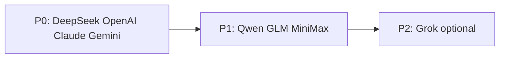

# v1.5 F0 — 平台模型网关 · 多厂商 · 套餐调价

> **更新**：2026-06-05  
> **类型**：v1.5 **P0 能力**（与 F1 Tab++ 并行，**建议先于或并列 W1 启动**）  
> **ADR**：[ADR_V1.5_PLATFORM_MODELS.md](./ADR_V1.5_PLATFORM_MODELS.md)  
> **状态**：✅ v1.5.0 F0 首版（网关 · 弃 BYOK UI · 加权配额 · 调价草案）

---

## 北极星

用户 **登录即用** 多厂商模型，**无需自备 API Key**；订阅费 **覆盖** 平台 API 成本，消除「双重付费」体感。

---

## 现状 vs 目标

| 项 | 现状 | v1.5 F0 目标 |
|----|------|--------------|
| 默认接入 | BYOK 或平台 DeepSeek | **平台唯一**（Ollama 除外） |
| 平台路由 | DeepSeek + OpenAI | **+ Claude · Gemini · Qwen · GLM · MiniMax** |
| 套餐 | Pro $4.99 | **Pro ~$9.99**（草案） |
| 配额 | 次/日 | **模型加权单位/日** |
| 设置 UI | Key 输入框 + keyMode | **模型选择器**（无 Key） |

---

## 任务（F0a–F0f）

| ID | 项 | 状态 |
|----|-----|:----:|
| **F0a** | `platformCatalog.ts` — 厂商 · endpoint · 默认模型 · env | ✅ |
| **F0b** | Provider adapters（OpenAI 兼容 + Anthropic + Gemini 原生） | ✅ |
| **F0c** | `modelWeights.ts` + `usage/ai` 扩展字段 | ✅ |
| **F0d** | 设置页：移除 BYOK · 模型分组（经济/标准/旗舰） | ✅ |
| **F0e** | `plans.ts` 调价 + Stripe/支付宝新 Price | ✅ |
| **F0f** | Tab/Agent/Inline 全走网关 · E2E · 迁移 toast | 🚧 |

---

## 厂商接入顺序



| 批次 | Provider | 备注 |
|------|----------|------|
| **P0** | deepseek · openai · claude · google | Chat GA 必需 |
| **P1** | qwen · zhipu · minimax | 国内主力 |
| **P2** | grok | 可选 |

---

## 验收（F0 GA）

| # | 项 |
|---|-----|
| 1 | 登录用户 **无 API Key** 可切换 ≥6 厂商并完成 Chat |
| 2 | 设置页 **无** BYOK 输入（Ollama 本地 URL 保留） |
| 3 | Free 用户仅可选 economy 模型；超限 429 + 升级引导 |
| 4 | Pro 用户可选 premium 模型；配额按 **权重** 扣减 |
| 5 | Tab / Agent 平台路径计入同一配额 |
| 6 | 平台 Key 不出现在客户端网络请求（仅 `/api/ai/*`） |
| 7 | `test:local` + `e2e/platform-models.spec.ts` 绿 |

---

## 环境变量（运维）

```bash
# 平台 Key（服务端 only）
PLATFORM_DEEPSEEK_API_KEY=
PLATFORM_OPENAI_API_KEY=
PLATFORM_ANTHROPIC_API_KEY=
PLATFORM_GOOGLE_API_KEY=
PLATFORM_QWEN_API_KEY=
PLATFORM_ZHIPU_API_KEY=
PLATFORM_MINIMAX_API_KEY=

# 功能
VITE_AI_GATEWAY=true
VITE_ALLOW_BYOK_LEGACY=false
```

---

## 禁止

- 客户端 bundle 含任何 `PLATFORM_*_API_KEY`
- v1.5 内开放 BYOK 给新用户
- 未调价即全量开放 frontier 模型给 Free

---

## 建议排期（与 F1 并行）

| 周 | F0 | F1 Tab++ |
|----|-----|----------|
| W1 | F0a catalog + F0b DeepSeek/OpenAI/Claude | ghost 布局 |
| W2 | F0b Gemini + F0d UI | FIM middle 生产化 |
| W3 | F0c 权重 + F0e 调价 | F1 验收 |
| W4 | F0f E2E + 迁移 | 启动 F2 |

---

## 相关

- [ROADMAP_V1.5.md](./ROADMAP_V1.5.md) § F0  
- [lib/api/aiGateway/platformConfig.ts](../lib/api/aiGateway/platformConfig.ts)（现有 DeepSeek/OpenAI）
