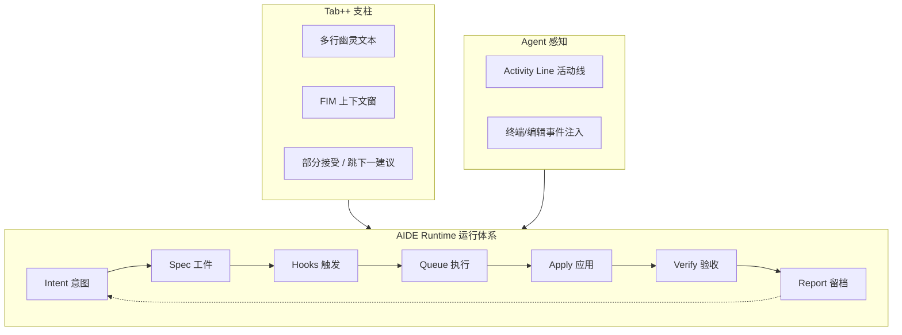

# v1.5 战略转向 — 高体验 + AIDE Runtime

> **日期**：2026-06-05  
> **决策**：继续 **零宣传**；目标从「基础填坑冲 3.4」升级为 **「高体验冲 3.5+」**  
> **前置**：v1.4.0 GA ✅ · v1.4.1 E2E 热修 ✅  
> **主规划**：[ROADMAP_V1.5.md](./ROADMAP_V1.5.md) · **运行体系**：[AIDE_RUNTIME.md](./AIDE_RUNTIME.md)

---

## 1. 为什么转向

v1.2～v1.4 把产品从 **~2.9** 抬到 **~3.3～3.4 门槛**。平台骨架、索引、Agent 闭环、生产策略已齐，但：

| 痛点 | 说明 |
|------|------|
| **Tab 体感** | 有 FIM 链与 P95 指标，但缺少 Cursor Tab++ 的「多行幽灵文本 / 跟手改码」惊艳感 |
| **Spec 工程** | v1.1.1 Plan/Spec 队列已闭环，但未升格为可对外讲的 **工程化交付体系**（对标 Kiro 的加分项） |
| **Agent 感知** | 工具 Agent 够用，缺 Windsurf Cascade 级 **活动线 / 实时上下文** |
| **差异化叙事** | 「浏览器 + 支付宝」是获客钩子，但 **留存** 要靠开发者日常「爽点」 |

**旧战略**（[PLAN_IDE5_AND_COMPETITORS.md](./PLAN_IDE5_AND_COMPETITORS.md)）：不追 Kiro Spec、不追 Cursor Tab++。  
**新战略**：**主动冲击** Tab++/Spec 体验档，并用 **AIDE Runtime**（独属运行体系）统一二者，而非复制 VS Code fork。

---

## 2. 新目标（v1.5 世代）

| 指标 | v1.4.0 | **v1.5 GA 目标** |
|------|:------:|:----------------:|
| 综合分（11 维） | ~3.35～3.4（待复评） | **≥3.50** |
| AI 与编辑融合 | ~3.0 | **≥3.8**（Tab++） |
| Agent / 多文件 | ~3.4 | **≥3.6**（Runtime + Activity Line） |
| 编辑与语言服务 | ~3.3 | **≥3.5**（维持，非主战场） |
| 宣传线 | 仍关闭 | **v1.5 GA 后单独决策**（不提前开） |

---

## 3. 双支柱 + 一层运行体系

| 支柱 | 对标 | 我们的做法 |
|------|------|------------|
| **Tab++** | Cursor Copilot++ | 多行 FIM + 周围文件上下文 + P95&lt;400ms；不绑平台模型 |
| **Spec 工程** | Kiro Specs/Hooks | `.aide/specs` + `hooks.yaml` + 验收自动化；**轻量**不追 AWS 审计链 |
| **AIDE Runtime** | 无直接竞品 | 把 Plan/Spec/Queue/Report **升格为统一运行内核** |

---

## 4. 仍不追（边界不变）

| 项 | 原因 |
|----|------|
| VSIX / VS Code 插件市场 | 成本与 Cursor 正面冲突 |
| 全语言 LSP / 完整 DAP | 浏览器 + 1 人主力不现实 |
| SSH / SSO / 企业合规全栈 | v1.6+ 再议 |
| 云后台 Agent 30min 级 | v1.6 队列深化，非 v1.5 主线 |
| **任何宣传 / 上架** | 直到 v1.5 GA + 单独决策 |

---

## 5. 与 v1.4.x 的关系

| 世代 | 角色 |
|------|------|
| **v1.4.x**（**1.4.1～1.4.9**） | 门禁 · Tab++/Runtime/Activity **RFC+spike+schema** · 深化抛光 · **v1.4 收官** |
| **v1.5.0** | F1–F8 大版本：Tab++ + AIDE Runtime + Activity Line **生产交付** |

**节奏**：与 v1.3.x 相同 — **做到 1.4.9 再开 v1.5.0**。详见 [V1.4.x_MASTER_PLAN.md](./V1.4.x_MASTER_PLAN.md)。

---

## 6. 文档索引

| 文档 | 用途 |
|------|------|
| [AIDE_RUNTIME.md](./AIDE_RUNTIME.md) | 运行体系架构与工件规范 |
| [ROADMAP_V1.5.md](./ROADMAP_V1.5.md) | v1.5 能力表与阶段 |
| [V1.5_KICKOFF.md](./V1.5_KICKOFF.md) | F1–F8 执行清单 |
| [ROADMAP_V1.4.x_PATCHES.md](./ROADMAP_V1.4.x_PATCHES.md) | patch 线 |
| [NEXT_EXECUTION.md](./NEXT_EXECUTION.md) | 当前工程入口 |
