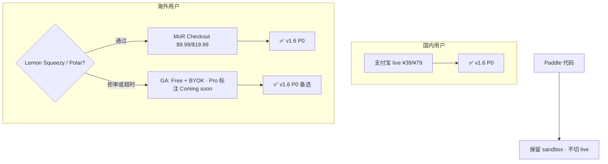

# v1.6 GA 执行清单 — 上市前最后一个大版本

> **更新**：2026-06-07  
> **定位**：v1.6 = **可对外 marketed 上市的平台 GA**，不是功能堆叠世代。  
> **原则**：P0 全部绿才能 tag `v1.6.0`；P1 可进 v1.6.1–1.6.3 patch，不挡首发。  
> **主规划**：[ROADMAP_V1.6.md](./ROADMAP_V1.6.md) · [V1.6_KICKOFF.md](./V1.6_KICKOFF.md)

---

## 1. 上市定义（v1.6.0 Done 的含义）

| 维度 | 通过标准 |
|------|----------|
| **国内收款** | 支付宝 **live** 实付 ¥39/¥79 smoke 绿 · notify 回跳升级订阅 |
| **海外收款** | MoR **live**（Lemon Squeezy / Polar 二选一）或 **明确 GA 策略**：海外 Free+BYOK、Pro 稍后 |
| **平台 AI** | `PLATFORM_DEEPSEEK_API_KEY` 生产配置 · 登录即用 · 配额/Team 档正确 |
| **订阅可信** | Neon migrate 自动化 · 订阅 API 不静默降级 · 到期/续费可预期 |
| **体验抛光** | Tab++ 生产默认 · 定价 UI 与 `plans.ts` 一致 · 欢迎/升级路径无困惑 |
| **运维** | smoke 5/5 · Cron（expire + jobs）· 法律页三链接可访问 |
| **质量** | `test:unit` ≥820 · E2E ≥70 · 综合分 **≥3.55** |
| **宣传** | v1.6.0 **仍不大规模投放**；GA tag 后另开「上市战役」文档 |

---

## 2. 当前状态快照（2026-06-07）

| 项 | 状态 | 备注 |
|----|:----:|------|
| v1.5.9 代码线 | ✅ | package `1.5.9` |
| Paddle MoR 代码 | ✅ 代码 / ❌ 商户 | Paddle **拒审**，需换通道 |
| 法律页 Terms/Privacy/Refund | ✅ | `/legal/*-en.html` 已部署 |
| Neon paddle 列 migrate | ✅ | 已手动 deploy |
| 订阅误显示免费 | ✅ 已修 | `readFailed` + migrate |
| 支付宝生产 AppID | 🔶 | `2021006159656645`，Vercel 待切 live |
| 支付宝 live smoke | ☐ | 实付 ¥39 验收 |
| 海外 MoR live | ☐ | Lemon Squeezy / Polar 注册 |
| `PLATFORM_DEEPSEEK_API_KEY` | ☐ | Chat 硬依赖 |
| Tab++ prod 默认 | 🔶 | `.env.production.example` 已开，需 Vercel 确认 |
| smoke 2 周 5/5 | ☐ | [V1.5.9_SMOKE_WEEKLY.md](./V1.5.9_SMOKE_WEEKLY.md) |

---

## 3. 阶段划分（F0–F8 修订）

### P0 — 不绿不发 v1.6.0

| ID | 主题 | 交付物 | 估时 |
|----|------|--------|:----:|
| **F1** | **国内支付生产** | Vercel live 密钥 · 开放平台 notify · 实付 smoke · [CN_PAYMENT_SETUP.md](./CN_PAYMENT_SETUP.md) | 2–3d |
| **F1b** | **海外支付决策+落地** | Paddle 下线/保留 sandbox；**Lemon Squeezy 或 Polar** 接入 **或** ADR「GA 仅国内付费」 | 3–7d |
| **F1c** | **平台 AI 生产** | `PLATFORM_DEEPSEEK_API_KEY` · gateway smoke · 超额 429 文案 | 1d |
| **F1d** | **订阅/DB 运维** | Vercel build migrate · `BILLING_CRON_SECRET` · expire cron 绿 | 1–2d |
| **F0** | **Tab++ 生产默认** | Vercel `VITE_TAB_PLUS_PLUS=1` · P95 抽测 · 设置页文案 | 2–3d |
| **F7** | **v1.6.0 GA 包** | `v16Features.ts` · RELEASE_NOTES · tag · deploy | 2d |

### P1 — v1.6.0 可并行，v1.6.1 patch 可收

| ID | 主题 | 说明 |
|----|------|------|
| **F2** | Electron 终端 / runCommand 诚实路径 | 桌面用户核心差异 |
| **F3** | 云后台 Agent Cron MVP | `jobs:process` 生产 · Pro 门禁 |
| **F4** | Runtime 抛光 | agent hook 排水 · 队列持久化 |
| **F1e** | 用量仪表盘 polish | 登录用户只读卡 · Team 档说明 |

### P2 — 文档/ADR，不挡 GA

| ID | 主题 |
|----|------|
| **F5** | 协作 Beta → RC 文档 + 双机 smoke |
| **F6** | SSH / SSO ADR |
| **F8** | `COMPETITOR_SCORE_V1.6.md` · v1.7 门 |

---

## 4. 支付路线（Paddle 拒审后）



**推荐顺序**：
1. 先打通 **支付宝 live**（你已有 AppID + 代码）
2. 同步申请 **Lemon Squeezy**（个人通过率通常高于 Paddle）
3. 7 天内无 live → 海外 GA 走 **Free+BYOK**，v1.6.1 再接 MoR

---

## 5. 子版本节奏（建议）

| 版本 | 目标 | 周期 |
|------|------|:----:|
| **v1.6.0** | 上市就绪 GA（P0 全绿） | W1–W4 |
| **v1.6.1** | 海外 MoR 或 Electron 终端 | +1–2w |
| **v1.6.2** | 云 Agent Cron MVP | +1–2w |
| **v1.6.3** | Runtime/协作 patch | 按需 |
| **v1.7.0** | marketed 大推 · 宣传战役 | v1.6 稳定 4 周后 |

---

## 6. 每周执行（1 人主力）

| 周 | 主线 | 验收 |
|----|------|------|
| **W1** | F1 支付宝 live + F1c 平台 Key + F1d migrate/cron | 国内实付 1 笔 · usage/ai 200 |
| **W2** | F1b 海外 MoR 或 ADR · F0 Tab prod | 英文 locale checkout 或 BYOK 公告 |
| **W3** | F7 文档/E2E/RELEASE · F1e 用量 UI | E2E ≥70 · smoke 5/5 |
| **W4** | tag `v1.6.0` · F8 评分 · 缓冲修 bug | COMPETITOR ≥3.55 |

---

## 7. v1.6.0 发版门禁

```bash
npm run test:local
npm run test:e2e:stack
npm run verify:env:v15          # 后续可增 verify:env:v16
npm run verify:alipay:prices -- --production
npm run billing:preflight:production
npm run smoke:production -- https://ai-ide-flame.vercel.app
npm run db:migrate:deploy       # 本地对 Neon 确认无 pending
```

| 检查项 | 命令/动作 |
|--------|-----------|
| 国内付得出去 | 小号 ¥39 → Pro 30 天 |
| 海外付得出去或已公告 | LS/Polar live **或** 订阅弹窗海外说明 |
| 团队版不被误降级 | 登录 → `/api/subscription` 200 · plan=enterprise |
| 法律三链 | terms / privacy / refund 200 |
| Cron | Vercel Cron expire + jobs 绿 |

---

## 8. 明确不做（仍属 v1.6）

- VSIX · 全语言 LSP · Kiro Hook 市场
- Paddle live（已拒审）
- 30min 无人 Cloud Agent（→ v1.7）
- 大规模宣传 / 应用商店（→ v1.6 GA 后单独立项）

---

## 9. 文档索引

| 文档 | 用途 |
|------|------|
| [V1.6_PAYMENT_DECISION.md](./V1.6_PAYMENT_DECISION.md) | 海外通道决策 |
| [CN_PAYMENT_SETUP.md](./CN_PAYMENT_SETUP.md) | 支付宝生产 |
| [PADDLE_SETUP.md](./PADDLE_SETUP.md) | Paddle 归档参考 |
| [V1.5.9_SMOKE_WEEKLY.md](./V1.5.9_SMOKE_WEEKLY.md) | 周 smoke |
| [NEXT_EXECUTION.md](./NEXT_EXECUTION.md) | 当前入口 |
